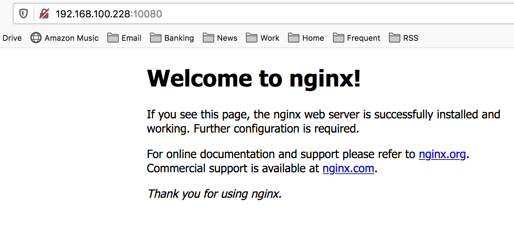

I had a friend reach out that is using a new 8G Raspberry Pi to learn some new technologies. Raspberry Pis are an excellent platform to geek out with and Kubernetes is a very hot technology on the market.

My friend is using MicroK8s to test and learn Kubernetes. While I know Kubernetes primitives from working over the years with OpenShift and now my work with EGX. I haven't personally messed with MicroK8s. Thought I'd investigate to learn with him.

## Prerequisites

* A system with An Ubuntu 20.04 LTS, 18.04 LTS or 16.04 LTS environment to run the commands
* At least 20G of disk space and 4G of memory are recommended
* An internet connection

I'll be using a VM on Proxmox with 8G ram, 4 vCPUs and 40G root disk.

I downloaded the latest Ubuntu 20.04 LTS Server ISO from:
[https://releases.ubuntu.com/20.04/](https://releases.ubuntu.com/20.04/)

I simply followed the steps in the install wizard. I enabled SSH and didn't install any specific packages that are offered near the end.

## Installation

I will follow the [MicroK8s installation guide](https://microk8s.io/docs).

To start, ssh to the Ubuntu server.

```
kevin:~$ ssh k8s@192.168.100.228
Warning: Permanently added '192.168.100.228' (ECDSA) to the list of known hosts.
k8s@192.168.100.228's password: 
Welcome to Ubuntu 20.04.1 LTS (GNU/Linux 5.4.0-56-generic x86_64)

 * Documentation:  https://help.ubuntu.com
 * Management:     https://landscape.canonical.com
 * Support:        https://ubuntu.com/advantage

  System information as of Tue Dec  8 00:45:22 UTC 2020

  System load:  0.06               Processes:              136
  Usage of /:   30.9% of 19.56GB   Users logged in:        1
  Memory usage: 2%                 IPv4 address for ens18: 192.168.100.228
  Swap usage:   0%


81 updates can be installed immediately.
0 of these updates are security updates.
To see these additional updates run: apt list --upgradable


Last login: Tue Dec  8 00:45:01 2020
To run a command as administrator (user "root"), use "sudo <command>".
See "man sudo_root" for details.

k8s@microk8s:~$
```

Now use snap to install MicroK8s.

```
k8s@microk8s:~$ sudo snap install microk8s --classic
[sudo] password for k8s: 
microk8s (1.19/stable) v1.19.3 from Canonical✓ installed
```

Add the current user to the microk8s group.

```
k8s@microk8s:~$ sudo usermod -a -G microk8s $USER
k8s@microk8s:~$ sudo chown -f -R $USER ~/.kube
k8s@microk8s:~$ su - $USER
Password: 
k8s@microk8s:~$
```

Now run the status command to wait for MicroK8s to be available. By the time I checked, MicroK8s was running ;)

```
k8s@microk8s:~$ microk8s status --wait-ready
microk8s is running
high-availability: no
  datastore master nodes: 127.0.0.1:19001
  datastore standby nodes: none
addons:
  enabled:
    ha-cluster           # Configure high availability on the current node
  disabled:
    ambassador           # Ambassador API Gateway and Ingress
    cilium               # SDN, fast with full network policy
    dashboard            # The Kubernetes dashboard
    dns                  # CoreDNS
    fluentd              # Elasticsearch-Fluentd-Kibana logging and monitoring
    gpu                  # Automatic enablement of Nvidia CUDA
    helm                 # Helm 2 - the package manager for Kubernetes
    helm3                # Helm 3 - Kubernetes package manager
    host-access          # Allow Pods connecting to Host services smoothly
    ingress              # Ingress controller for external access
    istio                # Core Istio service mesh services
    jaeger               # Kubernetes Jaeger operator with its simple config
    knative              # The Knative framework on Kubernetes.
    kubeflow             # Kubeflow for easy ML deployments
    linkerd              # Linkerd is a service mesh for Kubernetes and other frameworks
    metallb              # Loadbalancer for your Kubernetes cluster
    metrics-server       # K8s Metrics Server for API access to service metrics
    multus               # Multus CNI enables attaching multiple network interfaces to pods
    prometheus           # Prometheus operator for monitoring and logging
    rbac                 # Role-Based Access Control for authorisation
    registry             # Private image registry exposed on localhost:32000
    storage              # Storage class; allocates storage from host directory
```

Validate nodes and services.

```
k8s@microk8s:~$ microk8s kubectl get nodes
NAME       STATUS   ROLES    AGE     VERSION
microk8s   Ready    <none>   3m59s   v1.19.3-34+a56971609ff35a

k8s@microk8s:~$ microk8s kubectl get services
NAME         TYPE        CLUSTER-IP     EXTERNAL-IP   PORT(S)   AGE
kubernetes   ClusterIP   10.152.183.1   <none>        443/TCP   4m39s
```

Create an alias for kubectl to be called directly :)

```
k8s@microk8s:~$ echo "alias kubectl='microk8s kubectl'" > .bash_aliases
k8s@microk8s:~$ source .bash_aliases 
k8s@microk8s:~$ kubectl get nodes
NAME       STATUS   ROLES    AGE     VERSION
microk8s   Ready    <none>   5m30s   v1.19.3-34+a56971609ff35a
```

We have a k8s cluster now, but not a very useful one. MicroK8s provides many addons to make the cluster more useful (as seen in the status command output).

## Install Addons

First I will install several useful addons.

```
k8s@microk8s:~$ microk8s enable ingress dns storage prometheus
Enabling Ingress
namespace/ingress created
serviceaccount/nginx-ingress-microk8s-serviceaccount created
clusterrole.rbac.authorization.k8s.io/nginx-ingress-microk8s-clusterrole created
role.rbac.authorization.k8s.io/nginx-ingress-microk8s-role created
clusterrolebinding.rbac.authorization.k8s.io/nginx-ingress-microk8s created
rolebinding.rbac.authorization.k8s.io/nginx-ingress-microk8s created
configmap/nginx-load-balancer-microk8s-conf created
configmap/nginx-ingress-tcp-microk8s-conf created
configmap/nginx-ingress-udp-microk8s-conf created
daemonset.apps/nginx-ingress-microk8s-controller created
Ingress is enabled
Enabling DNS
Applying manifest
serviceaccount/coredns created
configmap/coredns created
deployment.apps/coredns created
service/kube-dns created
clusterrole.rbac.authorization.k8s.io/coredns created
clusterrolebinding.rbac.authorization.k8s.io/coredns created
Restarting kubelet
DNS is enabled
Enabling default storage class
... #lots of other output
servicemonitor.monitoring.coreos.com/kubelet created
The Prometheus operator is enabled (user/pass: admin/admin)
```

And install the dashboard addon.

```
k8s@microk8s:~$ microk8s enable dashboard
Enabling Kubernetes Dashboard
Enabling Metrics-Server
clusterrole.rbac.authorization.k8s.io/system:aggregated-metrics-reader unchanged
clusterrolebinding.rbac.authorization.k8s.io/metrics-server:system:auth-delegator created
rolebinding.rbac.authorization.k8s.io/metrics-server-auth-reader created
Warning: apiregistration.k8s.io/v1beta1 APIService is deprecated in v1.19+, unavailable in v1.22+; use apiregistration.k8s.io/v1 APIService
apiservice.apiregistration.k8s.io/v1beta1.metrics.k8s.io configured
serviceaccount/metrics-server created
deployment.apps/metrics-server created
service/metrics-server created
clusterrole.rbac.authorization.k8s.io/system:metrics-server created
clusterrolebinding.rbac.authorization.k8s.io/system:metrics-server created
clusterrolebinding.rbac.authorization.k8s.io/microk8s-admin created
Metrics-Server is enabled
Applying manifest
serviceaccount/kubernetes-dashboard created
service/kubernetes-dashboard created
secret/kubernetes-dashboard-certs created
secret/kubernetes-dashboard-csrf created
secret/kubernetes-dashboard-key-holder created
configmap/kubernetes-dashboard-settings created
role.rbac.authorization.k8s.io/kubernetes-dashboard created
clusterrole.rbac.authorization.k8s.io/kubernetes-dashboard created
rolebinding.rbac.authorization.k8s.io/kubernetes-dashboard created
clusterrolebinding.rbac.authorization.k8s.io/kubernetes-dashboard created
deployment.apps/kubernetes-dashboard created
service/dashboard-metrics-scraper created
deployment.apps/dashboard-metrics-scraper created

If RBAC is not enabled access the dashboard using the default token retrieved with:

token=$(microk8s kubectl -n kube-system get secret | grep default-token | cut -d " " -f1)
microk8s kubectl -n kube-system describe secret $token

In an RBAC enabled setup (microk8s enable RBAC) you need to create a user with restricted
permissions as shown in:
https://github.com/kubernetes/dashboard/blob/master/docs/user/access-control/creating-sample-user.md
Now we have lots of services running. But we still need to do some work to access things.

k8s@microk8s:~$ kubectl get services -A
NAMESPACE     NAME                        TYPE        CLUSTER-IP       EXTERNAL-IP   PORT(S)                        AGE
default       kubernetes                  ClusterIP   10.152.183.1     <none>        443/TCP                        17m
kube-system   kube-dns                    ClusterIP   10.152.183.10    <none>        53/UDP,53/TCP,9153/TCP         6m55s
monitoring    prometheus-operator         ClusterIP   None             <none>        8443/TCP                       6m28s
monitoring    alertmanager-main           ClusterIP   10.152.183.29    <none>        9093/TCP                       6m23s
monitoring    grafana                     ClusterIP   10.152.183.164   <none>        3000/TCP                       6m22s
monitoring    kube-state-metrics          ClusterIP   None             <none>        8443/TCP,9443/TCP              6m22s
monitoring    node-exporter               ClusterIP   None             <none>        9100/TCP                       6m21s
monitoring    prometheus-adapter          ClusterIP   10.152.183.79    <none>        443/TCP                        6m21s
monitoring    prometheus-k8s              ClusterIP   10.152.183.98    <none>        9090/TCP                       6m20s
kube-system   metrics-server              ClusterIP   10.152.183.158   <none>        443/TCP                        5m57s
kube-system   kubernetes-dashboard        ClusterIP   10.152.183.87    <none>        443/TCP                        5m53s
kube-system   dashboard-metrics-scraper   ClusterIP   10.152.183.228   <none>        8000/TCP                       5m51s
monitoring    alertmanager-operated       ClusterIP   None             <none>        9093/TCP,9094/TCP,9094/UDP     5m33s
kube-system   kubelet                     ClusterIP   None             <none>        10250/TCP,10255/TCP,4194/TCP   5m33s
monitoring    prometheus-operated         ClusterIP   None             <none>        9090/TCP                       5m33s
```

Because I didn't enable rbac, I need to use a token to access the dashboard.

```
k8s@microk8s:~$ token=$(kubectl -n kube-system get secret | grep default-token | cut -d " " -f1)
k8s@microk8s:~$ kubectl -n kube-system describe secret $token
Name:         default-token-x5pjv
Namespace:    kube-system
Labels:       <none>
Annotations:  kubernetes.io/service-account.name: default
              kubernetes.io/service-account.uid: 08f99c7a-d00c-4622-bb97-0bbcbb7707f3

Type:  kubernetes.io/service-account-token

Data
====
ca.crt:     1103 bytes
namespace:  11 bytes
token:      eyJhbGciOiJSUz......80JI5OA
```

The dashboard is listening on a cluster IP of 10.152.183.87 on port 443. However, because this is in a VM without a desktop, I need to do some port forward magic to expose this on my lab network.

```
k8s@microk8s:~$ kubectl port-forward -n kube-system service/kubernetes-dashboard --address=192.168.100.228 10443:443
Forwarding from 192.168.100.228:10443 -> 8443
```

Now I can hit the dashboard in a web browser on my laptop.


Paste the token from the previous step where it says "Enter token" and click Sign In to login.


Next, let's deploy a simple nginx server to test app deployment.

## Deploying the First App

Run the following to deploy nginx.

```
k8s@microk8s:~$ kubectl create deployment nginx --image=nginx
deployment.apps/nginx created
```

Now check that it is running.

```
k8s@microk8s:~$ kubectl get pods
NAME                     READY   STATUS    RESTARTS   AGE
nginx-6799fc88d8-88qnd   1/1     Running   0          45s
```

Well that's cool. But how do I access this new app? When deployed, a service was created.

I need to expose the nginx service on port 80.

```
k8s@microk8s:~$ kubectl expose deployment nginx --type=ClusterIP --port=80 --name=nginx-service
service/nginx-service exposed

#now we can see a service with a cluster ip of 10.152.183.229 for nginx
k8s@microk8s:~$ kubectl get service
NAME            TYPE        CLUSTER-IP      EXTERNAL-IP   PORT(S)   AGE
kubernetes      ClusterIP   10.152.183.1    <none>        443/TCP   44m
nginx-service   ClusterIP   10.152.183.67   <none>        80/TCP    26s
```

Because the cluster IP is internal (just like the Dashboard), we can port forward to this nginx service.

```
k8s@microk8s:~$ kubectl port-forward service/nginx-service --address=192.168.100.228 10080:80
Forwarding from 192.168.100.228:10080 -> 80
```

And if we hit our server on port 10080 in a web browser we will see our nginx app.



## Permanent Ingress

Port forward was cool, but the ingress addon will help us make access more useful. We need to update the tcp ingress ConfigMap to add the dashboard and nginx.

```
k8s@microk8s:~$ kubectl get configmaps -A
NAMESPACE     NAME                                                  DATA   AGE
kube-system   extension-apiserver-authentication                    6      57m
kube-system   calico-config                                         4      57m
kube-public   local-registry-hosting                                1      57m
ingress       nginx-load-balancer-microk8s-conf                     0      47m
ingress       nginx-ingress-tcp-microk8s-conf                       0      47m
ingress       nginx-ingress-udp-microk8s-conf                       0      47m
kube-system   coredns                                               1      47m
monitoring    grafana-dashboard-apiserver                           1      46m
monitoring    grafana-dashboard-cluster-total                       1      46m
monitoring    grafana-dashboard-controller-manager                  1      46m
monitoring    grafana-dashboard-k8s-resources-cluster               1      46m
monitoring    grafana-dashboard-k8s-resources-namespace             1      46m
monitoring    grafana-dashboard-k8s-resources-node                  1      46m
monitoring    grafana-dashboard-k8s-resources-pod                   1      46m
monitoring    grafana-dashboard-k8s-resources-workload              1      46m
monitoring    grafana-dashboard-k8s-resources-workloads-namespace   1      46m
monitoring    grafana-dashboard-kubelet                             1      46m
monitoring    grafana-dashboard-namespace-by-pod                    1      46m
monitoring    grafana-dashboard-namespace-by-workload               1      46m
monitoring    grafana-dashboard-node-cluster-rsrc-use               1      46m
monitoring    grafana-dashboard-node-rsrc-use                       1      46m
monitoring    grafana-dashboard-nodes                               1      46m
monitoring    grafana-dashboard-persistentvolumesusage              1      46m
monitoring    grafana-dashboard-pod-total                           1      46m
monitoring    grafana-dashboard-prometheus-remote-write             1      46m
monitoring    grafana-dashboard-prometheus                          1      46m
monitoring    grafana-dashboard-proxy                               1      46m
monitoring    grafana-dashboard-scheduler                           1      46m
monitoring    grafana-dashboard-statefulset                         1      46m
monitoring    grafana-dashboard-workload-total                      1      46m
monitoring    grafana-dashboards                                    1      46m
monitoring    adapter-config                                        1      46m
kube-system   kubernetes-dashboard-settings                         0      46m
monitoring    prometheus-k8s-rulefiles-0                            1      45m
ingress       ingress-controller-leader-nginx                       0      46m
Edit the ingress nginx-ingress-tcp-microk8s-conf ConfigMap.

k8s@microk8s:~$ kubectl edit configmap/nginx-ingress-tcp-microk8s-conf -n ingress
... #opens ConfigMap yaml in VI
```

I added two data items to the ConfigMap. Notice the data addition below with 10080 and 10443 lines added to create ingress to both nginx and the dashboard.

```
# Please edit the object below. Lines beginning with a '#' will be ignored,
# and an empty file will abort the edit. If an error occurs while saving this file will be
# reopened with the relevant failures.
#
apiVersion: v1
data:
  "10080": default/nginx-service:80
  "10443": kube-system/kubernetes-dashboard:443
kind: ConfigMap
metadata:
  annotations:
    kubectl.kubernetes.io/last-applied-configuration: |
      {"apiVersion":"v1","kind":"ConfigMap","metadata":{"annotations":{},"name":"nginx-ingress-tcp-microk8s-conf","namespace":"ingress"}}
  creationTimestamp: "2020-12-08T00:57:20Z"
  name: nginx-ingress-tcp-microk8s-conf
  namespace: ingress
  resourceVersion: "10248"
  selfLink: /api/v1/namespaces/ingress/configmaps/nginx-ingress-tcp-microk8s-conf
  uid: d5cf9f50-7c9d-4b1b-936a-ce8f9d473b5e
```

Then :wq to save and exit

```
...
configmap/nginx-ingress-tcp-microk8s-conf edited
```
Now both my MicroK8s dashboard and nginx app are available via ingress controller on ports 10443 and 10080 respectively. Reload them in your web browser and confirm access is working as expected.

## Conclusion

The experience deploying MicroK8s was pretty seamless. Raw k8s leaves a lot to the administrator and MicroK8s minimizes some of that barrier to entry. Comparatively to kubeadm deployment, the experience is pretty similar with MicroK8s having some tooling that simplifies post cluster configurations.

## Resources

* [https://microk8s.io/docs](https://microk8s.io/docs)
* [https://ubuntu.com/tutorials/install-a-local-kubernetes-with-microk8s](https://ubuntu.com/tutorials/install-a-local-kubernetes-with-microk8s)
* [https://microk8s.io/docs/addon-dashboard](https://microk8s.io/docs/addon-dashboard)
* [https://microk8s.io/docs/addon-ingress](https://microk8s.io/docs/addon-ingress)

