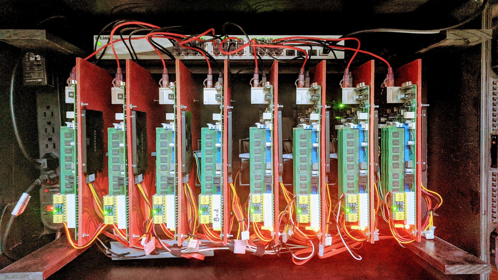
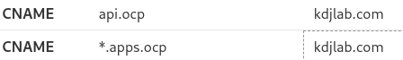
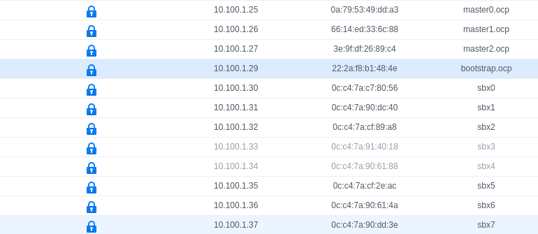
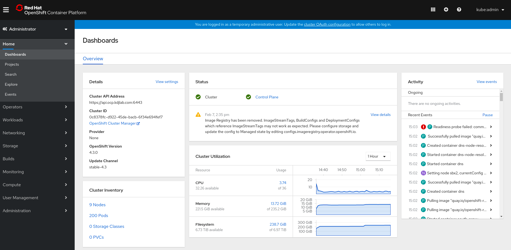

Quite a few years back, we started a project called Shadowbox (haha, I did not even know this [YouTube video](https://youtu.be/NOBgnnjOLPs) existed). Shadowbox is a home-built, portable lab environment. Being our first prototype, the lab was larger and more fragile than needed. However, over the years, Shadowbox taught us a ton about small form-factor, portable hardware kits. We also have learned a tremendous amount about automating Red Hat software deployments onto these kits.

The original Shadowbox hardware is underwhelming at this point. It is not very useful as a virtualization cluster. The lab consists of 8 SuperMicro micro ATX motherboards. Each board has a dual core I3 processor and 32Gb of non-ecc DDR3 memory. All of the nodes have a single 256Gb SSD hard drive. 3 of the nodes have a secondary 256Gb SSD and 3 of them have a 1Tb SSD.

OpenStack versions up to Newton still run decent on this hardware, but Traditional virtualization like RHV or VMware require too much overhead for these systems to be really useful. The CPUs are the limiting factor.

## What About Running Containers?

Last year around this time, Red Hat was heavily ramping up Kubevirt. [Kubevirt](https://kubevirt.io/) brings the ability to run and manage virtual machines to Kubernetes. I wanted to experiment with this technology and Shadowbox is a perfect lab for that purpose. I deployed a bare metal [OpenShift 3.11 cluster with Kubevirt](/posts/openshift/introduction-to-openshift-virtualization/). I ran this cluster for about 6 months and it actually performed really well.

The benefit of containers on bare metal is that they do not have the overhead of virtualization and are not an entire instantiation of the operating system. Adding Kubevirt to the cluster means that I can run the majority of workloads in containers. For those use cases where I still need a VM (like Windows :), I can run them on the same platform.

## OpenShift and Kubernetes Move Fast

[Kubernetes](https://kubernetes.io/docs/setup/release/version-skew-policy/) is on a quarterly release cycle. The community moves extremely fast. That means, as a Kubernetes operator, you also have to move fast to keep up.

OpenShift 4 is now 3 point releases in. [4.3 is the current release](https://blog.openshift.com/introducing-red-hat-openshift-4-3-to-enhance-kubernetes-security/) as of this writing. I decided it was time to deploy OpenShift 4.3 onto the Shadowbox lab. This is what will be discussed in the rest of this article.

A Few Terms
* OCP - [OpenShift Container Platform](https://www.openshift.com/)
* IPI - Installer provisioned infrastructure. This is an automated installation mechanism for OpenShift 4 on certain providers (AWS, GCE, Azure, OpenStack, etc.)
* UPI - User provisioned infrastructure. This is the installer mechanism that allows the customer to create the infrastructure needed for the deployment.
* Bare metal - This term is overloaded with OpenShift 4. This is used to describe any infrastructure where the OpenShift cluster is not aware of the provider it is running on. This also means that a lot of the automated goodness of OpenShift 4 for day 1 and day 2 operations is not available. I will be using this mechanism for this lab (as I am running bare metal servers, hints the overloading of the term)

## Architecture

I got my pull secret and links to the necessary docs and artifacts from [cloud.redhat.com Cluster Manager](https://cloud.redhat.com/openshift/). I clicked through the buttons to create a new bare metal cluster.

I will be following the [OpenShift 4.3 bare metal installation guide](https://docs.openshift.com/container-platform/4.3/installing/installing_bare_metal/installing-bare-metal.html). I got the 4.3.0 RHCOS images, installer and client from the [OpenShift mirror](https://mirror.openshift.com/pub/openshift-v4/dependencies/rhcos/4.3/4.3.0/).

OpenShift 4 currently requires a minimum of 7 servers to create an initial, production deployment. These can be all virtual machines, all bare metal servers or a mixture of both.

For this lab, I chose to mix virtual machines and the bare metal servers from Shadowbox.

* OpenShift Provisioner - The machine from which we run the installer. I will use a virtual machine for this node.
* Bootstrap Node - The initial machine that runs the Kubernetes API that the Masters will bootstrap off of. This machine is dispensable once the masters are up. I will use a virtual machine for this node.
* Masters - These are the control plane for the OpenShift/Kubernetes cluster. You need 3 of them for a highly available cluster. I will use 3 virtual machines for my masters.
* Workers - You need a minimum of two worker nodes. These are where all of the workloads will run. I will have 6 bare metal worker nodes in this deployment.
I will use a single network for my public side of the cluster. 10.100.0.0/22.

Note that you need to be conscious of the default settings for network configuration as they may conflict with preexisting networks in your environment.

## Prerequisites

Kubernetes and OpenShift require certain DNS records to be in place. If you are doing the IPI automatic installer on one of the public clouds or other supported providers, DNS records are manipulated for you. For the UPI deployment in this lab, I need to put them in place.

I need two public DNS records on my kdjlab.com domain. These will allow traffic from the internet to reach my edge router.



I also need several records set up on my internal DNS server. These are private to my home network. Below are my A records for an edge haproxy load balancer, the masters, bootstrap, OpenShift provisioner and the 6 bare metal servers that we will use as workers.

```
10.99.99.202 haproxy.ocp.kdjlab.com haproxy.ocp
10.100.1.25 master0.ocp.kdjlab.com master0.ocp etcd-0.ocp.kdjlab.com etcd-0.ocp
10.100.1.26 master1.ocp.kdjlab.com master1.ocp etcd-1.ocp.kdjlab.com etcd-1.ocp
10.100.1.27 master2.ocp.kdjlab.com master2.ocp etcd-2.ocp.kdjlab.com etcd-2.ocp
10.100.1.28 ocp-provisioner.kdjlab.com ocp-provisioner
10.100.1.29 bootstrap.ocp.kdjlab.com bootstrap.ocp
10.100.1.30 sbx0.kdjlab.com sbx0
10.100.1.31 sbx1.kdjlab.com sbx1
10.100.1.32 sbx2.kdjlab.com sbx2
10.100.1.35 sbx5.kdjlab.com sbx5
10.100.1.36 sbx6.kdjlab.com sbx6
10.100.1.37 sbx7.kdjlab.com sbx7
```

I also need a few other records. I need a wildcard record for the apps. I also need 3 SRV records for etcd. Lastly I need a CNAME record for the internal API.

```
address=/apps.ocp.kdjlab.com/10.99.99.202
cname=api-int.ocp.kdjlab.com,haproxy.ocp.kdjlab.com
srv-host=_etcd-server-ssl._tcp.ocp.kdjlab.com,etcd-0.ocp.kdjlab.com,2380,10,0
srv-host=_etcd-server-ssl._tcp.ocp.kdjlab.com,etcd-1.ocp.kdjlab.com,2380,10,0
srv-host=_etcd-server-ssl._tcp.ocp.kdjlab.com,etcd-2.ocp.kdjlab.com,2380,10,0
```

You will notice above that I brought in an haproxy load balancer which I have not mentioned. I am simply using that to distribute traffic to the bootstrap, masters and workers at different points in the process. This also allows me to send traffic south bound from the internet into my OpenShift cluster. This machine is a small container that is only running sshd and haproxy. I will include the [haproxy.cfg](https://github.com/redhat-kejones/ocp4-upi-baremetal/blob/master/files/haproxy.cfg.example) in the Git repository for this build out.

There are two other components in my infrastructure that I will not be discussing in detail here. I have a web server running that allows me to serve files out. This is useful for serving the OCP 4 images and the ignition files. I also have a PXE server setup already. I simply added options to PXE boot RHCOS for bootstrap, master and worker roles. The entries are as follows.

```
LABEL RHCOS Bootstrap
	MENU LABEL Install Bootstrap Ignition
	KERNEL ocp4/rhcos-4.3.0-x86_64-installer-kernel
	APPEND ip=dhcp rd.neednet=1 initrd=ocp4/rhcos-4.3.0-x86_64-installer-initramfs.img console=tty0 console=ttyS0 coreos.inst=yes coreos.inst.install_dev=vda coreos.inst.image_url=http://10.99.99.11/ocp4/rhcos-4.3.0-x86_64-metal.raw.gz coreos.inst.ignition_url=http://10.99.99.11/ocp4/ign/bootstrap.ign

LABEL RHCOS Master
	MENU LABEL Install Master Ignition
	KERNEL ocp4/rhcos-4.3.0-x86_64-installer-kernel
	APPEND ip=dhcp rd.neednet=1 initrd=ocp4/rhcos-4.3.0-x86_64-installer-initramfs.img console=tty0 console=ttyS0 coreos.inst=yes coreos.inst.install_dev=vda coreos.inst.image_url=http://10.99.99.11/ocp4/rhcos-4.3.0-x86_64-metal.raw.gz coreos.inst.ignition_url=http://10.99.99.11/ocp4/ign/master.ign

LABEL RHCOS Worker
	MENU LABEL Install Worker Ignition
	KERNEL ocp4/rhcos-4.3.0-x86_64-installer-kernel
	APPEND ip=dhcp rd.neednet=1 initrd=ocp4/rhcos-4.3.0-x86_64-installer-initramfs.img console=tty0 console=ttyS0 coreos.inst=yes coreos.inst.install_dev=vda coreos.inst.image_url=http://10.99.99.11/ocp4/rhcos-4.3.0-x86_64-metal.raw.gz coreos.inst.ignition_url=http://10.99.99.11/ocp4/ign/worker.ign
```

I will use the above entries in my default PXE menu for the bootstrap and master VMs. I also have individual PXE menus for the baremetal systems. This allows me to reboot them using IPMI and control what they boot (either PXE or local disk). All of the baremetal systems will be workers, so their PXE entry is as follows.

```
LABEL RHCOS
	MENU LABEL Install RHCOS Worker Ignition
	KERNEL ocp4/rhcos-4.3.0-x86_64-installer-kernel
	APPEND ip=eno1:dhcp rd.neednet=1 initrd=ocp4/rhcos-4.3.0-x86_64-installer-initramfs.img console=tty0 console=ttyS0 coreos.inst=yes coreos.inst.install_dev=sda coreos.inst.image_url=http://10.99.99.11/ocp4/rhcos-4.3.0-x86_64-metal.raw.gz coreos.inst.ignition_url=http://10.99.99.11/ocp4/ign/worker.ign
```

Notice the difference of vda vs. sda for target root disk. Also notice the IP declaration of eno1:dhcp on the baremetal entry. This is because those systems have 2 NICs. The VMs only have 1. Everything else is the same.

## Create Virtual Machines

As you see above, I will have 5 virtual machines that I deploy for this cluster. I need to create those first. The virtual machine infrastructure matters if you are building for production, as it has support implications. If you have questions about this, look at our [tested integrations for x86_64 infrastructure](https://access.redhat.com/articles/4763741).

In my lab, I am running ProxMox which uses KVM. This could be RHV, VMware, OpenStack or whatever. The bootstrap and master machines will be running Red Hat CoreOS (RHCOS). The OpenShift provisioner will run RHEL 8.1.

Throughout this build out I will use Ansible to automate the process. I also use pipenv to isolate the python dependencies. The details of this setup is not part of this article. However, the main repository and roles are available publicly.

I will run a playbook to create the necessary VMs. Note the haproxy container already exists and is not part of this automation.

```
$ ansible-playbook -i inventory/inventory.yml -e@vars/vars.yml playbooks/ocp4-upi-baremetal/create-vms.yml
```

The playbook above starts the OpenShift provisioner VM as the last task.

I also created static DHCP reservations for the bootstrap, master and worker machines. The workers I already had in place. The bootstrap and masters needed to be updated with the MACs of the new VMs.



## Configure the OpenShift Provisioner

Next I run a playbook to configure my OpenShift provisioner for deployment.

```
$ ansible-playbook -i inventory/inventory.yml -e@vars/vars.yml playbooks/ocp4-upi-baremetal/provisioner.yml
```

Now we have the OpenShift provisioner with the installer binary, oc and kubectl binaries in place. We need to begin the configuration for the actual OCP 4 cluster.

```
$ ansible-playbook -i inventory/inventory.yml -e@vars/vars.yml playbooks/ocp4-upi-baremetal/cluster-prep.yml
```

At the start of this playbook, it dumps a bunch of debug messages out for your review. This is a listing of all of the relevant DNS records (as the OpenShift provisioner sees them). It is important for you to review these and make sure they are right. Kubernetes (and therefore, OpenShift) really need correct DNS records to install and function properly.

For me, I had moved the etcd A records, but I did not restart my DNS server. This would have caused issues during deployment. I aborted the playbook (ctrl-c A), restarted my DNS server and reran the playbook to verify the changes.

At this point, I have a cluster configuration on my OpenShift provisioner. I have bootstrap, master, and worker nodes ready to go. I have DNS all straight. I have my load balancer, web server and PXE server ready. I also have the ignition files and OpenShift 4 images ready to go.

## Bring the Cluster to Life
Now I need to PXE boot all of the machines using the RHCOS images and the ignition configs.

For the VMs, I manually PXE booted them. I could automate this as well by specifying their MACs on creation and then creating PXE menu files for those MACs on my PXE server. This would mean that they would automatically PXE boot into either bootstrap or master ignition. I may eventually do this, but did not for this build out.


For the bare metal nodes, I have written a playbook to reset the nodes and PXE boot. They will automatically PXE with RHCOS and the worker ignition config.

Once the machines PXE, they reboot several times. There are ways to monitor the process. I watched consoles for the VMs and bare metal systems to see that they did complete the process. A few of my SuperMicro servers have an issue where they boot to a blank screen with a blinking cursor. Until I get that problem figured out, I have to babysit these nodes through the process.

You can run the below command to watch/check if the bootstrap process is completed.

```
[cloud-user@ocp-provisioner ocp4]$ openshift-install wait-for bootstrap-complete --dir=ocp/
INFO Waiting up to 30m0s for the Kubernetes API at https://api.ocp.kdjlab.com:6443... 
INFO API v1.16.2 up                               
INFO Waiting up to 30m0s for bootstrapping to complete... 
INFO It is now safe to remove the bootstrap resources
```

With this step complete, I can take the bootstrap node out of the haproxy load balancer config. I can also power the VM down and delete it. The bootstrap machine is only required to initialize the cluster.

As the masters and workers come online, there may be situations where the CSRs do not get automatically approved. We can see and approve these on the OpenShift provisioner.

```
[cloud-user@ocp-provisioner ocp4]$ oc get csr
NAME        AGE     REQUESTOR                                                                   CONDITION
csr-2wpx6   15m     system:serviceaccount:openshift-machine-config-operator:node-bootstrapper   Approved,Issued
csr-4vl65   6m36s   system:serviceaccount:openshift-machine-config-operator:node-bootstrapper   Pending
csr-7zgsz   15m     system:serviceaccount:openshift-machine-config-operator:node-bootstrapper   Approved,Issued
csr-bfwjv   15m     system:node:master2                                                         Approved,Issued
csr-bg8kg   7m40s   system:serviceaccount:openshift-machine-config-operator:node-bootstrapper   Pending
csr-cwsqv   15m     system:node:sbx0                                                            Approved,Issued
csr-dnkfb   15m     system:node:sbx5                                                            Approved,Issued
csr-mzzwd   15m     system:serviceaccount:openshift-machine-config-operator:node-bootstrapper   Approved,Issued
csr-nplwt   15m     system:node:master1                                                         Approved,Issued
csr-pg7x4   15m     system:node:sbx1                                                            Approved,Issued
csr-q57j8   15m     system:serviceaccount:openshift-machine-config-operator:node-bootstrapper   Approved,Issued
csr-sg44m   15m     system:serviceaccount:openshift-machine-config-operator:node-bootstrapper   Approved,Issued
csr-sz7fv   15m     system:node:master0                                                         Approved,Issued
csr-vs8j6   15m     system:serviceaccount:openshift-machine-config-operator:node-bootstrapper   Approved,Issued
```

I will go ahead and approve the pending ones.

```
$ oc get csr -o name | xargs oc adm certificate approve
```

I found that I had to run the two commands above to watch the list of CSRs and then approve pending ones over and over until all nodes were approved.

Once you see all your nodes in the oc get nodes output (like below), you can run a command to watch/check for the installation completion.

```
[cloud-user@ocp-provisioner ocp4]$ oc get nodes
NAME      STATUS   ROLES    AGE   VERSION
master0   Ready    master   43m   v1.16.2
master1   Ready    master   44m   v1.16.2
master2   Ready    master   44m   v1.16.2
sbx0      Ready    worker   43m   v1.16.2
sbx1      Ready    worker   43m   v1.16.2
sbx2      Ready    worker   45s   v1.16.2
sbx5      Ready    worker   43m   v1.16.2
sbx6      Ready    worker   26m   v1.16.2
sbx7      Ready    worker   26m   v1.16.2
```

We can check on the installation process by running the following command.

```
[cloud-user@ocp-provisioner ocp4]$ openshift-install wait-for install-complete --dir=ocp
INFO Waiting up to 30m0s for the cluster at https://api.ocp.kdjlab.com:6443 to initialize... 
INFO Waiting up to 10m0s for the openshift-console route to be created... 
INFO Install complete!                            
INFO To access the cluster as the system:admin user when using 'oc', run 'export KUBECONFIG=/home/cloud-user/ocp4/ocp/auth/kubeconfig' 
INFO Access the OpenShift web-console here: https://console-openshift-console.apps.ocp.kdjlab.com 
INFO Login to the console with user: kubeadmin, password: generated-p@ssw0rd
```

The output above says that we now have a working OCP 4.3 cluster!



One difference between OCP 3 and 4 is that with version 3, you would put a large initiative into the openshift-ansible inventory file. This meant that if your openshift-ansible run completed, your cluster would be completely configured and ready to use.

With 4, the installation gets the base OpenShift cluster up and running, but leaves other configuration options to be done post installation. This greatly simplifies the installation, but does require extra work once the cluster is up. The cool thing is that all this post configuration is based in operators.

In a follow on post, I will detail my post configurations.

## Resources

* [Ansible OCP4 Provisioner Role](https://github.com/redhat-kejones/ansible-ocp4-provisioner)
* [Git repository for OCP 4 UPI Bare Metal deployment](https://github.com/redhat-kejones/ocp4-upi-baremetal)