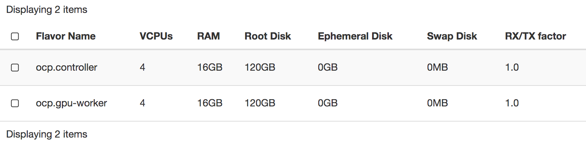
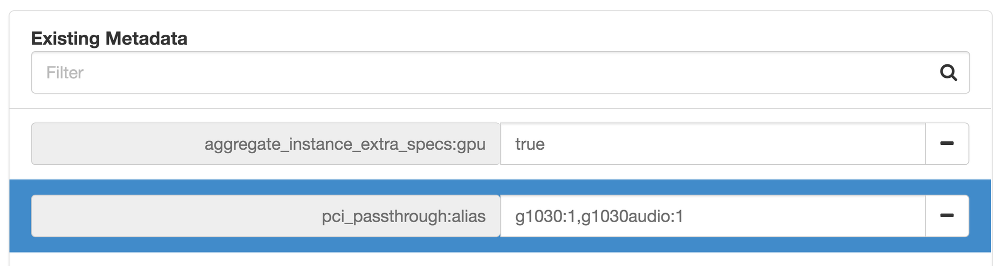
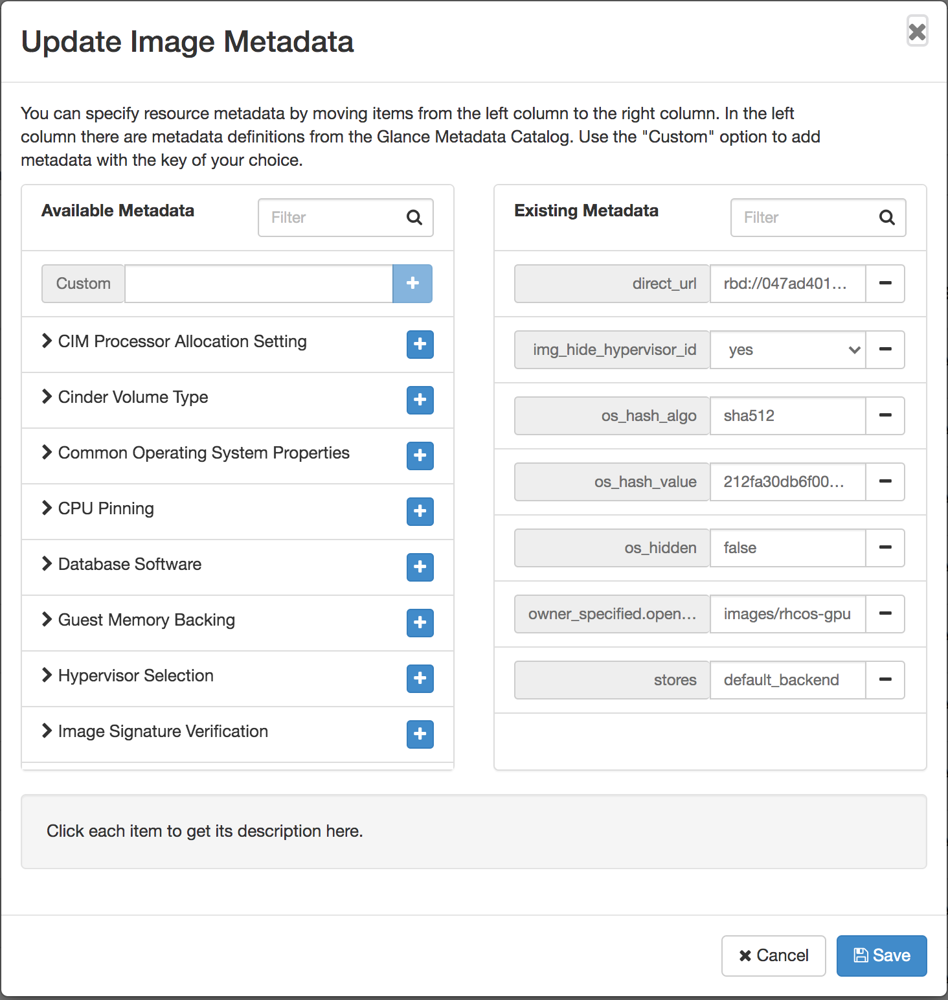
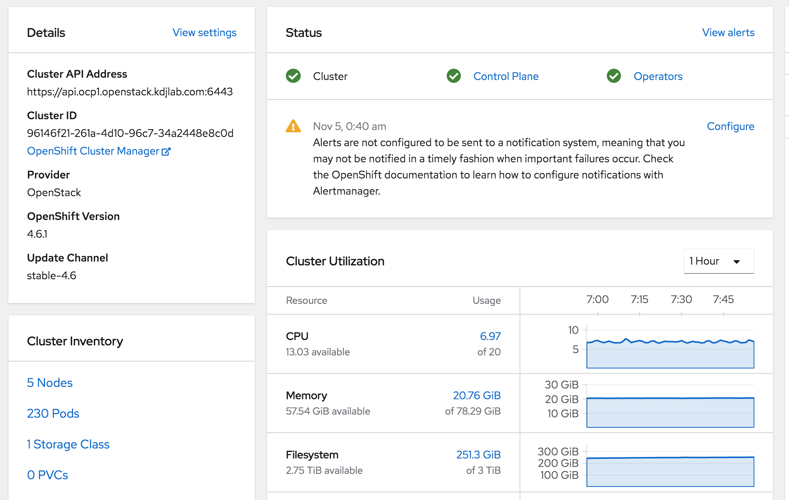

With my recent [home lab OpenStack cloud](/posts/deploying-rdo-in-a-cohesive-manner/), I wanted to test out OpenShift deployment with GPU worker nodes.

You need a system that can run the OpenShift install command. This can be a Linux, Windows or Mac system. I already had a Linux VM setup for this task.

We'll be following the official [IPI documentation for OpenShift on OpenStack](https://docs.openshift.com/container-platform/4.6/installing/installing_openstack/installing-openstack-installer-custom.html).

Head to [https://cloud.redhat.com/openshift/install/openstack/installer-provisioned](https://cloud.redhat.com/openshift/install/openstack/installer-provisioned). This is where you can get the links for the client and installer, as well as, your pull secret.

```
[cloud-user@ocp-provisioner 4.6]$ https://mirror.openshift.com/pub/openshift-v4/clients/ocp/latest-4.6/openshift-client-linux-4.6.1.tar.gz

[cloud-user@ocp-provisioner 4.6]$ tar xvf openshift-client-linux-4.6.1.tar.gz

[cloud-user@ocp-provisioner 4.6]$ https://mirror.openshift.com/pub/openshift-v4/clients/ocp/latest-4.6/openshift-install-linux-4.6.1.tar.gz

[cloud-user@ocp-provisioner 4.6]$ tar xvf openshift-install-linux-4.6.1.tar.gz
```

Next I need my clouds.yaml file. This can be downloaded from the OpenStack Dashboard. Place this file in the directory you will run the openshift-install from.

## OpenStack Prerequisites

Assign the swiftoperator role to the OpenStack user.

```
$ openstack role add --user operator --project operators swiftoperator
```

In your deployment you also need to set the following parameter for DNS servers on neutron networks.

```
NeutronDhcpAgentDnsmasqDnsServers: ['10.99.99.12','1.1.1.1']
```

The OpenShift doc specifies the quota requirements for the target project.

I have two flavors created, ocp.controller and ocp.gpu-worker.



The ocp.gpu-worker flavor has the following metadata property set to pass through a GPU using the g1030 alias and the HD Audio device using the g1030audio alias.



In order to make sure my controllers go to CPU nodes and my workers land on GPU nodes, I set up two host aggregates and set the gpu=true for my gpu-worker flavor and gpu=false for my controller flavor.

I also chose to upload the Red Hat CoreOS image into glance.

```
$ openstack image create --container-format bare --disk-format qcow2 --min-disk 25 --min-ram 16384 --file /home/stack/overcloud_guest_images/rhcos-4.6.1-x86_64-openstack.x86_64.qcow2 --public rhcos-gpu
```

This step is not necessary, but I wanted to set a metadata parameter on the image.



Lastly, you need two floating IPs in your project. You will use these for two DNS records. Below are the records in my dnsmasq server.

```
address=/apps.ocp1.openstack.kdjlab.com/192.168.100.144
host-record=api.ocp1.openstack.kdjlab.com,192.168.100.141
```

I needed to make a few more modifications to my OpenStack configuration to get the GPU Operator to work with the GPUs I am working with.

I had to configure Nova to use host-model for the CPU mode of KVM. This way when my instances get created, they have host-model set as mode in the CPU section of their XML definition.

I also needed to tell the kernel to set both the GPU and the HD Audio devices as vfio-pci IDs.

I added the following to my node-info.yaml environment file and reran my OpenStack deployment script to apply these new configurations.

```
parameter_defaults:
...
  ComputeParameters:
    NovaReservedHostMemory: 1024
    NovaCPUAllocationRatio: 16.0
    KernelArgs: "intel_iommu=on iommu=pt vfio-pci.ids=10de:1d01,10de:0fb8"
...
  ComputeExtraConfig:
    nova::compute::libvirt::cpu_mode: host-model
```

## Create the Install Config

```
[cloud-user@ocp-provisioner ~]$ ./4.6/openshift-install create install-config --dir=openstack/ocp1/
```

Answer the prompts as you go.

Edit the install config. Notice the floating IP settings in the install config below which will match my DNS records above. I also made a few other adjustments.

```
apiVersion: v1
baseDomain: openstack.kdjlab.com
compute:
- architecture: amd64
  hyperthreading: Enabled
  name: worker
  platform:
    openstack:
      type: ocp.gpu-worker
  replicas: 2
controlPlane:
  architecture: amd64
  hyperthreading: Enabled
  name: master
  platform:
    openstack:
      type: ocp.controller
  replicas: 3
metadata:
  creationTimestamp: null
  name: ocp1
networking:
  clusterNetwork:
  - cidr: 10.128.0.0/14
    hostPrefix: 23
  machineNetwork:
  - cidr: 10.0.0.0/16
  networkType: OVNKubernetes
  serviceNetwork:
  - 172.30.0.0/16
platform:
  openstack:
    apiVIP: 10.0.0.5
    cloud: openstack
    clusterOSImage: rhcos-gpu
    computeFlavor: ocp.controller
    externalDNS: ["10.99.99.12"]
    externalNetwork: public
    ingressVIP: 10.0.0.7
    lbFloatingIP: 192.168.100.141
    ingressFloatingIP: 192.168.100.144
    octaviaSupport: "0"
    region: "regionOne"
    trunkSupport: "1"
publish: External
pullSecret: 'get yours from cloud.redhat.com'
sshKey: |
  ssh-rsa AAAA...x5tS/ ansible-generated on ocp-provisioner.kdjlab.com
```

## Deploy the OpenShift Cluster

```
[cloud-user@ocp-provisioner ~]$ ./4.6/openshift-install create cluster --dir=openstack/ocp1 --log-level=debug
...
INFO Install complete!
INFO To access the cluster as the system:admin user when using 'oc', run 'export KUBECONFIG=/home/cloud-user/openstack/ocp1/auth/kubeconfig'                                                                                                     
INFO Access the OpenShift web-console here: https://console-openshift-console.apps.ocp1.openstack.kdjlab.com
INFO Login to the console with user: "kubeadmin", and password: "...."
DEBUG Time elapsed per stage:
DEBUG     Infrastructure: 3m11s
DEBUG Bootstrap Complete: 16m26s
DEBUG                API: 2m18s
DEBUG  Bootstrap Destroy: 53s
DEBUG  Cluster Operators: 39m19s
INFO Time elapsed: 1h0m9s
```



## Connect to the Cluster via CLI

```
[cloud-user@ocp-provisioner ~]$ export KUBECONFIG=/home/cloud-user/openstack/ocp1/auth/kubeconfig

[cloud-user@ocp-provisioner ~]$ ./4.6/oc get nodes
NAME                        STATUS   ROLES    AGE     VERSION
ocp1-mmqhh-master-0         Ready    master   7h47m   v1.19.0+d59ce34
ocp1-mmqhh-master-1         Ready    master   7h48m   v1.19.0+d59ce34
ocp1-mmqhh-master-2         Ready    master   7h47m   v1.19.0+d59ce34
ocp1-mmqhh-worker-0-k8hp6   Ready    worker   7h29m   v1.19.0+d59ce34
ocp1-mmqhh-worker-0-qwlg5   Ready    worker   7h27m   v1.19.0+d59ce34

[cloud-user@ocp-provisioner ~]$ ./4.6/oc get clusteroperators
NAME                                       VERSION   AVAILABLE   PROGRESSING   DEGRADED   SINCE
authentication                             4.6.1     True        False         False      7h4m
cloud-credential                           4.6.1     True        False         False      7h53m
cluster-autoscaler                         4.6.1     True        False         False      7h46m
config-operator                            4.6.1     True        False         False      7h47m
console                                    4.6.1     True        False         False      7h20m
csi-snapshot-controller                    4.6.1     True        False         False      7h32m
dns                                        4.6.1     True        False         False      7h44m
etcd                                       4.6.1     True        False         False      7h45m
image-registry                             4.6.1     True        False         False      7h23m
ingress                                    4.6.1     True        False         False      7h23m
insights                                   4.6.1     True        False         False      7h47m
kube-apiserver                             4.6.1     True        False         False      7h43m
kube-controller-manager                    4.6.1     True        False         False      7h44m
kube-scheduler                             4.6.1     True        False         False      7h43m
kube-storage-version-migrator              4.6.1     True        False         False      7h32m
machine-api                                4.6.1     True        False         False      7h41m
machine-approver                           4.6.1     True        False         False      7h45m
machine-config                             4.6.1     True        False         False      7h46m
marketplace                                4.6.1     True        False         False      7h44m
monitoring                                 4.6.1     True        False         False      12m
network                                    4.6.1     True        False         False      7h48m
node-tuning                                4.6.1     True        False         False      7h47m
openshift-apiserver                        4.6.1     True        False         False      7h24m
openshift-controller-manager               4.6.1     True        False         False      7h22m
openshift-samples                          4.6.1     True        False         False      7h20m
operator-lifecycle-manager                 4.6.1     True        False         False      7h45m
operator-lifecycle-manager-catalog         4.6.1     True        False         False      7h45m
operator-lifecycle-manager-packageserver   4.6.1     True        False         False      7h22m
service-ca                                 4.6.1     True        False         False      7h47m
storage                                    4.6.1     True        False         False      7h47m
```

## Check Worker for GPU

By default, floating IPs are not assigned to any of the OpenShift instances. If you want SSH access from a system that is not on the private network they are on, you will need to associate a floating IP to the instance you would like to connect to. You should disassociate it once done.

You can see below, my worker node has a GPU available (and the associated HD Audio device).

```
[core@ocp1-mmqhh-worker-0-k8hp6 ~]$ lspci -nnv | grep -i nvidia
00:05.0 VGA compatible controller [0300]: NVIDIA Corporation GP108 [GeForce GT 1030] [10de:1d01] (rev a1) (prog-if 00 [VGA controller])
00:06.0 Audio device [0403]: NVIDIA Corporation GP108 High Definition Audio Controller [10de:0fb8] (rev a1)
```

In the next post, I'll go through deploying the NVIDIA GPU Operator onto this cluster.


