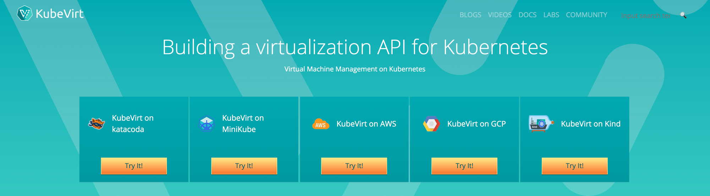

There is a service that goes along with Kubevirt to allow us to import virtual machine disk images into persistent volumes (PVs) on our Kubernetes cluster. These PVs can then be used to create virtual machines in Kubevirt. This is in addition to the setup I show in my original [Introduction to OpenShift Virtualization](https://kdjlab.com/introduction-to-openshift-virtualization/). [Kubevirt](https://kubevirt.io/) gives us the ability to add virtualization to an existing Kubernetes cluster.

## Prerequisites

This post does not cover deployment of OpenShift or Kubevirt. For those, use the following docs:

1. [OpenShift v3.11 Docs](https://docs.openshift.com/container-platform/3.11/welcome/index.html)
2. [Introduction to OpenShift Virtualization](https://kdjlab.com/introduction-to-openshift-virtualization/)

This post assumes you’ve download the latest RHEL 7 KVM cloud image from Red Hat.

You will also need libguestfs-tools installed to run the virt-customize command below.

## Setting up CDI Upload Proxy

NOTE: These commands should be run from a machine that has access, and is authenticated to your kubernetes cluster.

[Official documentation](https://kubevirt.io/user-guide/docs/latest/administration/image-upload.html)

First set the active project to kube-system.

```
$ oc project kube-system
```

Then set the CDI version and apply the cdi-controller template.

```
$ VERSION=v1.3.0
$ kubectl create -f https://github.com/kubevirt/containerized-data-importer/releases/download/$VERSION/cdi-controller.yaml
```

Next, create a route for the CDI upload proxy service.

```
$ oc create route passthrough --service=cdi-uploadproxy --port 8443
```

Modify the base RHEL 7 image to set the root password. You’d do well to change it in the command below :)

```
virt-customize -a /var/lib/libvirt/images/rhel-guest-image-7.qcow2 --root-password password:redhat
```

Now let’s create a new project for our VMs and PVs.

```
$ oc new-project vms
```

Last, we upload the base RHEL 7 image with the modified root password.

```
$ ./virtctl image-upload --image-path rhel-server-7.5-x86_64-kvm.qcow2 --pvc-name rhel75-mod --pvc-size 10Gi --storage-class glusterfs-storage --uploadproxy-url https://cdi-uploadproxy-kube-system.apps.kjw3.llc --wait-secs 300 --insecure
```

NOTE: I am using the glusterfs-storage class in my cluster. You may need to adjust depending on what storage clasees are available in your cluster.