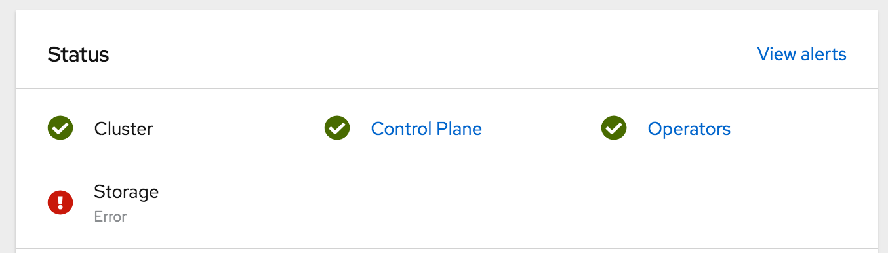

Recently I went to check on my OpenShift 4 bare metal lab. I noticed that my OpenShift Container Storage (OCS) 4 cluster was in error state. OCS 4 is based on [Red Hat Ceph](https://www.redhat.com/en/technologies/storage/ceph) software defined storage.

I have a ton of experience with Ceph as the backing storage for OpenStack. I am very comfortable using the Ceph CLI to get health state and diagnose errors. But where in OpenShift/OCS can I get access to the Ceph CLI?

Luckily for us, the rook-ceph-operator pod allows for us to access the CLI along with the OCS Ceph cluster configuration.

If we use this configuration file along with the Ceph CLI in the rook-ceph-operator pod, we can dig in on what our Ceph cluster is complaining about. First let's run ceph -s to see overall cluster status.

With this output we can confirm the Ceph cluster is in HEALTH_ERR state. We can also see there is 1 scrub error with an inconsistent placement group (pg). To get more detail on the specific pg, let's now run a health detail command.

By this we can see that pg, 2.50, is our bad actor. Let's see if we can do some Ceph magic to get that pg back in good shape.

Now to check health detail and cluster status again.

Luckily for us, this was a simple correction. There are definitely more challenging error situations to deal with when it comes to Ceph, but at least this shows you how to get access to the CLI to know exactly what is going on in your OCS 4 cluster.

