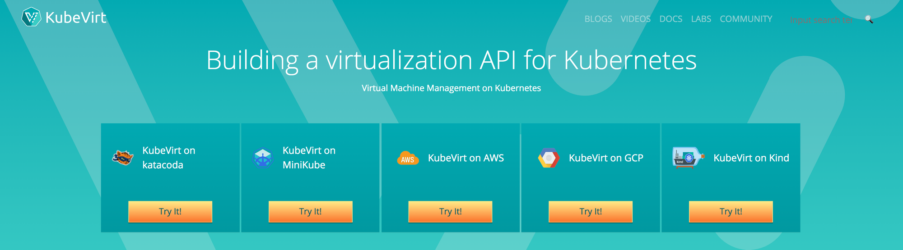

Recently I published a follow on video to my original [Introduction to OpenShift Virtualization](https://youtu.be/kzcToqgd23A). [Kubevirt](https://kubevirt.io/) gives us the ability to add virtualization to an existing Kubernetes cluster. In the environment shown in the video, I am running OKD v3.11. In the video, I launch a RHEL 7 virtual machine and expose port 22 so I can access it over SSH. The template I used to create the virtual machine was built from an upstream project called [Kubevirt Common Templates](https://github.com/kubevirt/common-templates). In this post, I will teach you how to generate these common templates.



## Prerequisites

This post does not cover deployment of OpenShift or Kubevirt. For those, use the following docs:

1. [OpenShift v3.11 Docs](https://docs.openshift.com/container-platform/3.11/welcome/index.html)
2. [Introduction to OpenShift Virtualization](https://kdjlab.com/introduction-to-openshift-virtualization/)

Access to a machine that has Ansible and Git installed.

## Install Necessary Packages and Clone the common-templates Repo

First thing we need to do is install the required packages.

```
$ yum install -y intltool osinfo-db-tools libosinfo
```

Next, we need to clone the common-templates repository.

```
$ git clone https://github.com/kubevirt/common-templates
```

## Prep Git Repository for Build

Change to the common templates directory created during the git clone.

```
$ cd common-templates
```

Initialize and update the git submodules.

```
$ git submodule init
$ git submodule update
```

## Build the osinfo Database

Now we need to run our make command to build the osinfo database.

```
$ make -C osinfo-db
```

## Generate the Templates

Now We Can Generate the Templates Using Ansible.

```
$ ansible-playbook generate-templates.yaml
```

Once the playbook completes, you can see all the generated templates in the dist/templates directory.

```
$ ls dist/templates/
```

## Creating, Starting and Exposing a Virtual Machine Using a Template

NOTE: Make sure you are in the common-templates directory

Create the virtual machine using one of the templates.

```
$ oc process --local -f dist/templates/rhel7-server-small.yaml NAME=rhel7-small-vm PVCNAME=rhel75 > rhel7-small-vm.yaml
$ oc apply -f rhel7-small-vm.yaml
```

Start the virtual machine using virtctl. Note that my virtctl utility is one directory above common-templates.

```
$ ../virtctl start rhel7-small-vm
```

Expose port 22 as node port on the cluster. This will allow us to access the virtual machine via SSH.

```
$ ../virtctl expose vmi rhel7-small-vm --port=22 --name=rhel7-small-vm-ssh --type=NodePort
```

You will need to list the services to see which port was assigned. Once you have the port, you can ssh to any node in your cluster using the assigned port to access the virtual machine.

```
$ oc get services
$ ssh cloud-user@master1 -p 31938
```

I can also expose other ports/services. In the video, you will see me expose port 80 and then create a route to access the web server.

```
$ ../virtctl expose vmi rhel7-small-vm --port=80 --name=rhel7-lamp-http --type=ClusterIP
$ oc expose svc/rhel7-lamp-http
```

Finally, to delete the virtual machine.

```
$ oc delete -f rhel7-small-vm.yaml
```