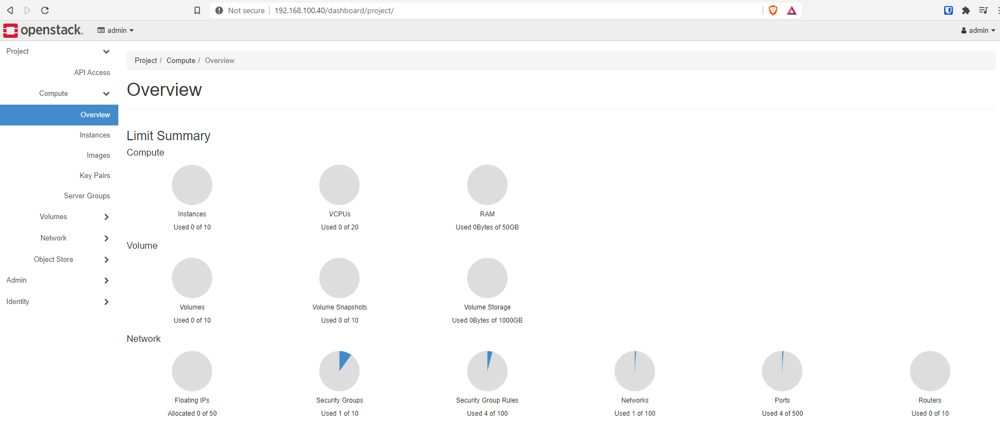
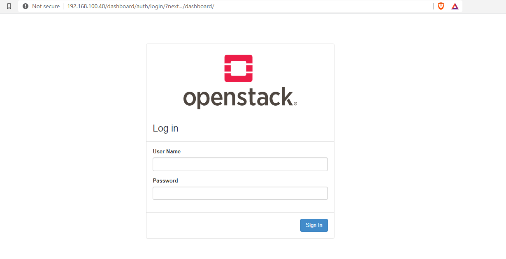

In [Part 1](/posts/openstack/deploying-rdo-in-a-cohesive-manner), I went through deploying the undercloud and getting the physical overcloud nodes inspected, cleaned and ready for deployment.

In this article, I will finish our OpenStack deployment using TripleO. At the end I will have a fully functioning, highly available OpenStack cloud for my home lab. All of the artifacts and templates are available in this GitHub repository:

[https://github.com/kjw3/rdo-sbx](https://github.com/kjw3/rdo-sbx)

The official documentation can be found in:

[https://docs.openstack.org/project-deploy-guide/tripleo-docs/latest/deployment/install_overcloud.html#deploy-the-overcloud](https://docs.openstack.org/project-deploy-guide/tripleo-docs/latest/deployment/install_overcloud.html#deploy-the-overcloud)

## Creating the Deployment Script

The overcloud is deployed with a single command.

```
$ openstack overcloud deploy
```

That is actually true. That command will attempt to deploy an OpenStack overcloud. It will deploy 1 controller and 1 compute with 1 interface on the provisioning network. This is cool if you are just trying things out. The truth is we need quite a bit more in our deployment command (still one command, by the way). First I'll show it, then I'll walk through all of the parameters and files listed.

I like to keep this command in a simple bash script at /home/stack/deploy.sh. This allows me to version control it and (**VERY IMPORTANT**) allows me to rerun the same command without forgetting or mistyping something.

```
[stack@tripleo ~]$ cp rdo-sbx/deploy.sh /home/stack/
[stack@tripleo ~]$ cat deploy.sh 
#!/usr/bin/env bash

source ~/stackrc

time openstack overcloud deploy --templates \
  -r /home/stack/templates/roles_data.yaml \
  -n /home/stack/templates/network_data.yaml \
  -e /home/stack/templates/containers-prepare-parameter.yaml \
  -e /usr/share/openstack-tripleo-heat-templates/environments/podman.yaml \
  -e /home/stack/templates/podman-ha.yaml \
  -e /usr/share/openstack-tripleo-heat-templates/environments/enable-swap.yaml \
  -e /usr/share/openstack-tripleo-heat-templates/environments/disable-telemetry.yaml \
  -e /home/stack/templates/node-info.yaml \
  -e /home/stack/templates/inject-trust-anchor-hiera.yaml \
  -e /usr/share/openstack-tripleo-heat-templates/environments/services/octavia.yaml \
  -e /usr/share/openstack-tripleo-heat-templates/environments/ceph-ansible/ceph-ansible.yaml \
  -e /usr/share/openstack-tripleo-heat-templates/environments/ceph-ansible/ceph-rgw.yaml \
  -e /usr/share/openstack-tripleo-heat-templates/environments/ceph-ansible/ceph-dashboard.yaml \
  -e /usr/share/openstack-tripleo-heat-templates/environments/cinder-backup.yaml \
  -e /home/stack/templates/ceph-environment.yaml \
  -e /usr/share/openstack-tripleo-heat-templates/environments/services/neutron-ovn-dvr-ha.yaml \
  -e /home/stack/templates/network-isolation.yaml \
  -e /home/stack/templates/network-environment.yaml \
  -e /home/stack/templates/firstboot-environment.yaml
```

I want to say first that this isn't the end all/be all for TripleO OpenStack deployments. However, it does incorporate the last few years of my experience deploying with TripleO to get what I'd consider a common, stable, production architected deployment of OpenStack. You will have your own considerations based on your hardware, networking, security requirements and feature needs, that will determine what your deploy command ultimately should be. This is a good baseline with a few customizations thrown in for my lab gear.

## Line By Line Walk Through

```
time openstack overcloud deploy --templates \
```

The time command is added so that I can get an idea of total run time but not necessary, just habit.

openstack overcloud deploy - I already talked about. This is the core of the command. Anything in the OpenStack unified CLI that has undercloud or overcloud as the second word is a TripleO command.

--templates - (without a path following it) tells the command to utilize the default template location at /usr/share/openstack-tripleo-heat-templates

```
-r /home/stack/templates/roles_data.yaml \
```

This line tells the command to use the roles_data.yaml file in /home/stack/templates to override the default roles file. In OpenStack Newton, TripleO introduced [composable roles](https://docs.openstack.org/project-deploy-guide/tripleo-docs/latest/features/custom_roles.html), the ability to compose the OpenStack server roles. Before that there were only 5 predefined roles.

This roles_data.yaml file allows me to modify the predefined roles and add custom roles.

The main customizations I make is moving the Ceph OSD service around and what networks get utilized in each role.

In my deployment, I use Controller, Compute, and ComputeHCI roles. The roles_data.yaml is generated by the following command.

```
[stack@tripleo ~]$ source stackrc 
(undercloud) [stack@tripleo ~]$ openstack overcloud roles generate -o ~/templates/roles_data.yaml Controller Compute ComputeHCI
```

The only change I made is to add the Ceph OSD service to the Controller role.

```
    - OS::TripleO::Services::Zaqar
    #Additional Services
    - OS::TripleO::Services::CephOSD
```

I'm only doing this to take advantage of a second disk on my controllers in my lab. Never a need to do this in a production cloud. Used dedicated ceph-storage nodes or hyper-converged computes.

```
-n /home/stack/templates/network_data.yaml \
```

In Queens, TripleO added [composable networks](https://docs.openstack.org/project-deploy-guide/tripleo-docs/latest/features/custom_networks.html). This allows you to modify and add the networks utilized in your deployment. Prior versions were very opinionated about what networks could be defined and used.

All production deployments should utilize [network isolation](https://docs.openstack.org/project-deploy-guide/tripleo-docs/latest/features/network_isolation.html). Composable networks significantly extends the flexibility with networking.

I simply modified the values of the default network_data.yaml to match my networks. I also disable the management network. I don't use it in my lab.

```
-e /home/stack/templates/containers-prepare-parameter.yaml \
```

This is our first -e environment template. In fact all the rest are environment templates. These are templates that are applied during the deployment to either extend or override templates in the default template folder.

I don't need to explain much here. This template was generated for us during the undercloud deployment process in the part 1 article.

```
-e /usr/share/openstack-tripleo-heat-templates/environments/podman.yaml \
```

Notice the path on this environment file. This is a template that does not get included in RDO deployments by default. It is a template that I can include unmodified (thus referencing the default path).

Because I chose to run CentOS 8 and the overcloud I am deploying will be containerized, I want podman to be used. This template sets the ContainerCLI parameter to podman.

```
-e /home/stack/templates/podman-ha.yaml \
```

Now if you reference the documentation on [making your overcloud highly available](https://docs.openstack.org/project-deploy-guide/tripleo-docs/latest/features/high_availability.html), it has you include a docker-ha.yaml file from the default template location.

With CentOS 8 (or RHEL 8), podman is the container tool of choice. However, we still want the deployment to include the high availability configurations. I can not straight include the docker-ha.yaml as is because it resets the ContainerCLI back to docker.

So instead I copied the default docker-ha.yaml template to /home/stack/templates/podman-ha.yaml. I removed the ContainerCLI parameter from the default_parameters section. Lastly I updated all of the relative paths to replace ../ for /usr/share/openstack-tripleo-heat-templates/.

You must deploy 3 controllers for an HA control plane.

```
-e /usr/share/openstack-tripleo-heat-templates/environments/enable-swap.yaml \
```

This environment template says to deploy swap on my controllers. No mod needed to the template.

```
-e /usr/share/openstack-tripleo-heat-templates/environments/disable-telemetry.yaml \
```

This environment file tells the deployment to disable OpenStack telemetry services. In my lab, I do not need telemetry and my nodes are not very powerful. This will save the resources normally consumed by the telemetry services for something else. A production cloud likely would want telemetry deployed.

```
-e /home/stack/templates/node-info.yaml \
```

This is the first template that you will see which is not generated or available in the default template location. This is a single environment file where I specify any extra parameters.

```
(undercloud) [stack@tripleo ~]$ cat templates/node-info.yaml 
parameter_defaults:
  ControllerCount: 3
  OvercloudControllerFlavor: control
  ComputeCount: 2
  OvercloudComputeFlavor: compute
  CephStorageCount: 0
  OvercloudCephStorageFlavor: ceph-storage
  OvercloudComputeHCIFlavor: computeHCI
  ComputeHCICount: 3
  #Other Params
  NovaComputeLibvirtType: kvm
  NtpServer: 10.99.99.1
  AdminPassword: p@ssw0rd
  CephAnsiblePlaybookVerbosity: 1
  NeutronDhcpAgentDnsmasqDnsServers: ['10.99.99.12','1.1.1.1']
  CloudName: openstack.kdjlab.com
  CloudDomain: kdjlab.com
  TimeZone: 'US/Eastern'
  ComputeHCIParameters:
    NovaReservedHostMemory: 2048
    NovaCPUAllocationRatio: 16.0
  ComputeParameters:
    NovaReservedHostMemory: 2048
    NovaCPUAllocationRatio: 16.0
```

Most of these are self explanatory. I am deploying 3 controllers, 2 regular computes, and 3 hyper-converged computes. I set my NTP server, a super strong Admin password, default DNS servers for Neutron to hand out, and time zone.

CloudName is the FQDN that the API and UI will be available at. CloudDomain is the base domain for the cluster.

Lastly I set custom reserved host memory and CPU allocation ratios for both Compute and ComputeHCI roles. 16:1 is actually the default Nova ratio in TripleO deployments. Production clouds will run lower depending on hardware and use cases. Production clouds will also reserve more memory for the hosts. I don't have much to spare in my lab nodes.

```
-e /home/stack/templates/inject-trust-anchor-hiera.yaml \
```

In part 1, we deployed our undercloud with self-signed TLS certs on the endpoints. This means we need to inject the CA from the undercloud into the overcloud nodes so they may trust the undercloud cert. This environment template would also be utilized if [deploying TLS on the overcloud](https://docs.openstack.org/project-deploy-guide/tripleo-docs/latest/features/ssl.html). I am not in this lab, but production clouds should.

On the undercloud, you can find the content for the CA at the top of the /etc/pki/tls/private/overcloud_endpoint.pem file.

```
-e /usr/share/openstack-tripleo-heat-templates/environments/services/octavia.yaml \
```

This unmodified environment file deploys Octavia which is the Load Balancing as-a-Service offering in OpenStack.

```
-e /usr/share/openstack-tripleo-heat-templates/environments/ceph-ansible/ceph-ansible.yaml \
```

This unmodified environment template tells the deployment to deploy Ceph with ceph-ansible.

```
-e /usr/share/openstack-tripleo-heat-templates/environments/ceph-ansible/ceph-rgw.yaml \
```

This unmodified environment file tells the deployment to deploy and configure the Ceph Rados Gateway service and configure it to back the OpenStack Object Storage API.

```
-e /usr/share/openstack-tripleo-heat-templates/environments/ceph-ansible/ceph-dashboard.yaml \
```

This unmodified environment file tells the deployment to deploy the Ceph Grafana Dashboard.

```
-e /usr/share/openstack-tripleo-heat-templates/environments/cinder-backup.yaml \
```

The last of our unmodified environment templates, enables the Cinder backup API.

```
-e /home/stack/templates/ceph-environment.yaml \
```

This environment file has all of the settings to deploy Ceph for our storage services. Ceph will back block, object, and ephemeral in my lab. It could also back the file share service, Manilla.

```
(undercloud) [stack@tripleo ~]$ cat rdo-sbx/templates/ceph-environment.yaml 
parameter_defaults:
  CinderBackupBackend: ceph
  CephPoolDefaultSize: 2
  CephConfigOverrides:
    osd_pool_default_size: 2
    osd_pool_default_min_size: 2
    osd_pool_default_pg_num: 8
    osd_pool_default_pgp_num: 8
    osd_recovery_op_priority: 2
    osd_recovery_max_active: 2
    osd_max_backfills: 1
  #NOTE: below needs to be derived using pgcalc
  CephPools:
    - name: volumes
      pg_num: 128
      application: rbd
    - name: vms
      pg_num: 32
      application: rbd
    - name: images
      pg_num: 16
      application: rbd
    - name: backups
      pg_num: 32
      application: rbd
    - name: metrics
      pg_num: 32
      application: openstack_gnocchi
    - name: default.rgw.buckets.index
      pg_num: 8
      application: rgw
    - name: default.rgw.buckets.data
      pg_num: 64
      application: rgw
  CephAnsibleDisksConfig:
    dmcrypt: false
    osd_auto_discovery: true
    osd_scenario: lvm
    osd_objectstore: bluestore
```

Going through all the possibilities for Ceph is beyond the scope here. However, this is an example of how I deploy in my lab. There is a cool tool called [pgcalc](https://access.redhat.com/labsinfo/cephpgc) to help you calculate some of the key numbers based on your own available hardware. You need a Red Hat Network account to access that version. I like the Red Hat version because it has options for Ceph+OpenStack.

```
-e /usr/share/openstack-tripleo-heat-templates/environments/services/neutron-ovn-dvr-ha.yaml \
```

For this release, I am going to use OVN for the software defined networking layer.

According to Red Hat OpenStack Platform [documentation on OVN](https://access.redhat.com/documentation/en-us/red_hat_openstack_platform/16.1/html-single/networking_with_open_virtual_network/index), I want OVN deployed in a highly available manner with distributed virtual routing (DVR). That is the purpose of this environment template. Also remember that in part 1 there was a small note about using DVR with computes. With our Compute and ComputeHCI roles and DVR, we must add External network ports to support this. You can see this in the next template (network-isolation.yaml) and in my nic-configs for Compute and ComputeHCI roles.

```
-e /home/stack/templates/network-isolation.yaml \
```

As mentioned earlier, [network isolation](https://docs.openstack.org/project-deploy-guide/tripleo-docs/latest/features/network_isolation.html) is a must for a usable, stable OpenStack cloud. This file enables all the different VIPs and ports for the different roles.

This file can actually be automatically generated by just pointing to /usr/share/openstack-tripleo-heat-templates/environments/network-isolation.yaml

You may notice that this file doesn't exist. There is however a .j2 jinja template.

```
-e /home/stack/templates/network-environment.yaml \
```

The network-environment file is critical. It contains all the parameters that configure the networking on the nodes and Neutron in the overcloud.

At the top of this environment file has resource definitions that point to the role nic configurations. These files are the number one stumbling block to successful TripleO deployments. The define how the network interfaces will be configured on your physical servers.

```
resource_registry:
  # Network Interface templates to use (these files must exist). You can
  # override these by including one of the net-*.yaml environment files,
  # such as net-bond-with-vlans.yaml, or modifying the list here.
  # Port assignments for the Controller
  OS::TripleO::Controller::Net::SoftwareConfig:
    /home/stack/templates/nic-configs/controller.yaml
  # Port assignments for the Compute
  OS::TripleO::Compute::Net::SoftwareConfig:
    /home/stack/templates/nic-configs/compute.yaml
  # Port assignments for the ComputeHCI
  OS::TripleO::ComputeHCI::Net::SoftwareConfig:
    /home/stack/templates/nic-configs/computehci.yaml
```

All of my nodes are the same. They have 2 1G nics. I put these 2 nics in an OVS bond (balance-slb mode). The bond is an interface on an OVS bridge named br-ex. I make the provisioning network untagged (flat in OpenStack terms) and tag all other vlans on the bridge using the bond as their physical interface. You can explore each of the role nic configs in the [git repository](https://github.com/kjw3/rdo-sbx).

The only other parameters I added or changed in the network-environment file are below.

```
  PublicVirtualFixedIPs: [{'ip_address':'192.168.100.40'}]

  # Define the DNS servers (maximum 2) for the overcloud nodes
  # When the list is not set or empty, the nameservers on the ctlplane subnets will be used.
  # (ctlplane subnets nameservers are controlled by the ``undercloud_nameservers`` option in ``undercloud.conf``)
  DnsServers: ['10.99.99.12']
  DnsSearchDomains: ['kdjlab.com']
  # List of Neutron network types for tenant networks (will be used in order)
  NeutronNetworkType: 'geneve,vlan'
  # Neutron VLAN ranges per network, for example 'datacentre:1:499,tenant:500:1000':
  NeutronNetworkVLANRanges: 'datacentre:1:4000'
  # Customize bonding options, e.g. "mode=4 lacp_rate=1 updelay=1000 miimon=100"
  # for Linux bonds w/LACP, or "bond_mode=active-backup" for OVS active/backup.
  BondInterfaceOvsOptions: "bond_mode=balance-slb"
```

I added PublicVirtualFixedIps which will set a static IP for the overcloud API public endpoints and the OpenStack Dashboard (Horizon).

I also added DnsServers and DnsSearchDomains.

I opened up the allowed vlan range from 1:1000 to 1:4000 for the physical network named datacentre (British spelling, don't ask).

I changed the bond options to balance-slb mode.

```
-e /home/stack/templates/firstboot-environment.yaml
```

Last one! This one is simple. It allows us to specify a script to run on first boot of each node. In this case, I'm only using it to set a root password. I highly recommend this because it allows you to get console login on nodes in case networking deployment fails (which happens a ton in early deployment attempts).

Take some time and peruse through all of these artifacts in the [git repository](https://github.com/kjw3/rdo-sbx). Especially the network configurations.

## Generating Example Templates

TripleO provides a script that generates a directory of overcloud deployment templates based on your roles_data.yaml and network_data.yaml templates. You can find the documenation for this in the network-isolation doc.

[https://docs.openstack.org/project-deploy-guide/tripleo-docs/latest/features/network_isolation.html](https://docs.openstack.org/project-deploy-guide/tripleo-docs/latest/features/network_isolation.html)

Even though I didn't use this process for this deployment, I wanted to talk about it. This is a nice feature that tremendously helps, particularly with the network configuration templates.

```
(undercloud) [stack@tripleo ~]$ /usr/share/openstack-tripleo-heat-templates/tools/process-templates.py \
      -p /usr/share/openstack-tripleo-heat-templates \
      -r /home/stack/templates/roles_data.yaml \
      -n /home/stack/templates/network_data.yaml \
      -o /home/stack/generated-openstack-tripleo-heat-templates --safe
```

If you install tree and run against the /home/stack/generated-openstack-tripleo-heat-templates directory you will see all the directories and files that got created.

Files or areas of interest in this generated set of templates are:

```
├── environments
...
│   ├── network-environment-v6-all.yaml
│   ├── network-environment-v6.yaml
│   ├── network-environment.yaml
│   ├── network-isolation-no-tunneling.yaml
│   ├── network-isolation-v6-all.yaml
│   ├── network-isolation-v6.yaml
│   ├── network-isolation.yaml
...
├── network
│   ├── config
│   │   ├── 2-linux-bonds-vlans
│   │   │   ├── computehci.yaml
│   │   │   ├── compute.yaml
│   │   │   ├── controller.yaml
│   │   │   └── README.md
│   │   ├── bond-with-vlans
│   │   │   ├── computehci.yaml
│   │   │   ├── compute.yaml
│   │   │   ├── controller-no-external.yaml
│   │   │   ├── controller.yaml
│   │   │   └── README.md
│   │   ├── multiple-nics
│   │   │   ├── compute-dvr.yaml
│   │   │   ├── computehci.yaml
│   │   │   ├── compute.yaml
│   │   │   ├── controller.yaml
│   │   │   └── README.md
│   │   ├── multiple-nics-vlans
│   │   │   ├── compute-dvr.yaml
│   │   │   ├── computehci.yaml
│   │   │   ├── compute.yaml
│   │   │   ├── controller.yaml
│   │   │   └── README.md
│   │   ├── single-nic-linux-bridge-vlans
│   │   │   ├── computehci.yaml
│   │   │   ├── compute.yaml
│   │   │   ├── controller.yaml
│   │   │   └── README.md
│   │   └── single-nic-vlans
│   │       ├── computehci.yaml
│   │       ├── compute.yaml
│   │       ├── controller-no-external.yaml
│   │       ├── controller.yaml
│   │       └── README.md
```

Using this generated network environment files and the network/config examples will get you much closer to a successful network deployment than if you try to create these files from scratch.

## Deploying Overcloud

After all of this, we are ready to attempt our first deployment. I prefer to run the deployments in either tmux or screen. I'm on CentOS 8 so tmux it is.

```
(undercloud) [stack@tripleo ~]$ tmux ls
ops: 1 windows (created Thu Sep 17 14:17:37 2020) [187x37]
(undercloud) [stack@tripleo ~]$ tmux a -t ops

(undercloud) [stack@tripleo ~]$ ./deploy.sh 
...
```

Time to get some coffee or whatever your beverage of choice is :).

Most bare metal overcloud deployments take over an hour. This lab takes 80 minutes from start to finish. Depending on the scale, could take multiple hours. Be patient. The stdout of the deployment is significantly improved to help understand where in the deployment you are and if there are any issues.

## Poking Around During Deployment

The deployment will first create a deployment plan (which is stored in swift on the undercloud), then a heat stack. During the heat stack creation, provisioning of the overcloud nodes will be attempted. It is recommended to watch several of the machines go through the provisioning process.

You will see them power on, pxe boot, boot the deployment ramdisk. Then they will write the overcloud-full operating system image to the selected root device. If the operating system gets written correctly, the nodes will be rebooted and boot into the root operating system. The network configuration for the nodes will be laid down. If this is successful, you are 98% likely to be successful :)

You can see details about the overcloud nodes by running a few commands on the undercloud.

```
[stack@tripleo ~]$ source stackrc 
(undercloud) [stack@tripleo ~]$ openstack server list
+--------------------------------------+-------------------------+--------+----------------------+----------------+------------+
| ID                                   | Name                    | Status | Networks             | Image          | Flavor     |
+--------------------------------------+-------------------------+--------+----------------------+----------------+------------+
| 74d241d8-bf9a-4ea8-9564-2903ea5e238c | overcloud-controller-1  | ACTIVE | ctlplane=10.100.4.84 | overcloud-full | control    |
| b174822f-c668-4e67-bd9f-56a6bc06a030 | overcloud-controller-0  | ACTIVE | ctlplane=10.100.4.79 | overcloud-full | control    |
| 0a06da72-1c1e-4974-a15a-e64634bc7a46 | overcloud-controller-2  | ACTIVE | ctlplane=10.100.4.75 | overcloud-full | control    |
| 1bf0e15a-bdff-444a-a795-eed45aeeb89b | overcloud-computehci-2  | ACTIVE | ctlplane=10.100.4.82 | overcloud-full | computeHCI |
| c0466d23-e978-4919-8e22-1b8def050d13 | overcloud-computehci-0  | ACTIVE | ctlplane=10.100.4.71 | overcloud-full | computeHCI |
| 58a67c27-fa84-48b6-a957-b0da311a6129 | overcloud-computehci-1  | ACTIVE | ctlplane=10.100.4.86 | overcloud-full | computeHCI |
| 38ca2bb6-af03-4783-b31b-7f628e8df7e7 | overcloud-novacompute-0 | ACTIVE | ctlplane=10.100.4.78 | overcloud-full | compute    |
| 6de440c0-4809-40e0-900a-672dce55ca89 | overcloud-novacompute-1 | ACTIVE | ctlplane=10.100.4.85 | overcloud-full | compute    |
+--------------------------------------+-------------------------+--------+----------------------+----------------+------------+

#we can ssh to the systems using the heat-admin user
(undercloud) [stack@tripleo ~]$ ssh heat-admin@10.100.4.84
Activate the web console with: systemctl enable --now cockpit.socket

Last login: Thu Sep 24 09:13:14 2020 from 10.100.4.5
[heat-admin@overcloud-controller-1 ~]$ sudo -i
[root@overcloud-controller-1 ~]#
```

If for whatever reason the network configuration fails and you set a root password with the firstboot template, you can get console on the machines through the out of band management interface and login as root to troubleshoot.

Assuming networking is correct, you will see CREATE_COMPLETE for the heat stack. In prior versions of TripleO this was a complete overcloud. Now it is just the start. You have basic linux overcloud nodes running, but no OpenStack services are configured or running.

The default behavior in TripleO now is to utilize a feature called config-download. This takes all your configurations from your overcloud plan and creates a directory of Ansible playbooks. Execution of these playbooks is the next step in the deployment process.

If deploying Ceph, this is your most likely next point of failure. The execution runs ceph-ansible from the undercloud.

Once the ceph-mon container is running on one of your overcloud controllers, you can get access to the ceph CLI inside of the mon container.

```
[root@overcloud-controller-1 ~]# podman ps
CONTAINER ID  IMAGE                                                                                          COMMAND               CREATED             STATUS                 PORTS  NAMES
ce3d99d529fa  tripleo.ctlplane.localdomain:8787/prom/prometheus:v2.7.2                                       --config.file=/et...  About a minute ago  Up About a minute ago         prometheus
1dc919b79a9a  tripleo.ctlplane.localdomain:8787/prom/alertmanager:v0.16.2                                    --config.file=/et...  About a minute ago  Up About a minute ago         alertmanager
c78fc7ddb76d  tripleo.ctlplane.localdomain:8787/grafana/grafana:5.2.4                                                              About a minute ago  Up About a minute ago         grafana-server
bad395843e90  tripleo.ctlplane.localdomain:8787/prom/node-exporter:v0.17.0                                   --path.procfs=/ho...  2 minutes ago       Up 2 minutes ago              node-exporter
10f9e962b820  tripleo.ctlplane.localdomain:8787/ceph/daemon:v4.0.12-stable-4.0-nautilus-centos-7-x86_64                            5 minutes ago       Up 5 minutes ago              ceph-rgw-overcloud-controller-1-rgw0
643516cdbd3c  tripleo.ctlplane.localdomain:8787/ceph/daemon:v4.0.12-stable-4.0-nautilus-centos-7-x86_64                            8 minutes ago       Up 8 minutes ago              ceph-osd-4
df37f0cdf468  tripleo.ctlplane.localdomain:8787/ceph/daemon:v4.0.12-stable-4.0-nautilus-centos-7-x86_64                            10 minutes ago      Up 10 minutes ago             ceph-mgr-overcloud-controller-1
eb6180c26b8c  tripleo.ctlplane.localdomain:8787/ceph/daemon:v4.0.12-stable-4.0-nautilus-centos-7-x86_64                            11 minutes ago      Up 11 minutes ago             ceph-mon-overcloud-controller-1
a78976943137  tripleo.ctlplane.localdomain:8787/tripleotraincentos8/centos-binary-memcached:current-tripleo  kolla_start           16 minutes ago      Up 16 minutes ago             memcached

#Enter into the Ceph Mon container to check on the Ceph cluster
[root@overcloud-controller-1 ~]# podman exec -it ceph-mon-overcloud-controller-1 /bin/bash
bash: warning: setlocale: LC_CTYPE: cannot change locale (en_US.UTF-8): No such file or directory
bash: warning: setlocale: LC_COLLATE: cannot change locale (en_US.UTF-8): No such file or directory
bash: warning: setlocale: LC_MESSAGES: cannot change locale (en_US.UTF-8): No such file or directory
bash: warning: setlocale: LC_NUMERIC: cannot change locale (en_US.UTF-8): No such file or directory
bash: warning: setlocale: LC_TIME: cannot change locale (en_US.UTF-8): No such file or directory
[root@overcloud-controller-1 /]# ceph -s
  cluster:
    id:     419cdf6e-6d76-414e-8565-9862e906998f
    health: HEALTH_OK
 
  services:
    mon: 3 daemons, quorum overcloud-controller-0,overcloud-controller-1,overcloud-controller-2 (age 12m)
    mgr: overcloud-controller-0(active, since 55s), standbys: overcloud-controller-1, overcloud-controller-2
    osd: 6 osds: 6 up (since 9m), 6 in (since 9m)
    rgw: 3 daemons active (overcloud-controller-0.rgw0, overcloud-controller-1.rgw0, overcloud-controller-2.rgw0)
 
  data:
    pools:   11 pools, 344 pgs
    objects: 191 objects, 2.7 KiB
    usage:   6.0 GiB used, 3.5 TiB / 3.5 TiB avail
    pgs:     344 active+clean
```

Once the Ansible is executing you will see at certain points step 1-5. There are 5 major steps in the deployment process. There are also some pre and post tasks. If you get to step 5, you are very close to complete.

When the deployment does complete, you will see something similar to the output below.

```
PLAY RECAP *********************************************************************
overcloud-computehci-0     : ok=279  changed=161  unreachable=0    failed=0    skipped=280  rescued=0    ignored=0   
overcloud-computehci-1     : ok=279  changed=161  unreachable=0    failed=0    skipped=280  rescued=0    ignored=0   
overcloud-computehci-2     : ok=279  changed=161  unreachable=0    failed=0    skipped=280  rescued=0    ignored=0   
overcloud-controller-0     : ok=321  changed=188  unreachable=0    failed=0    skipped=275  rescued=0    ignored=0   
overcloud-controller-1     : ok=303  changed=188  unreachable=0    failed=0    skipped=276  rescued=0    ignored=0   
overcloud-controller-2     : ok=303  changed=188  unreachable=0    failed=0    skipped=276  rescued=0    ignored=0   
overcloud-novacompute-0    : ok=283  changed=162  unreachable=0    failed=0    skipped=279  rescued=0    ignored=0   
overcloud-novacompute-1    : ok=280  changed=162  unreachable=0    failed=0    skipped=279  rescued=0    ignored=0   
undercloud                 : ok=175  changed=51   unreachable=0    failed=0    skipped=55   rescued=0    ignored=0   

Thursday 24 September 2020  13:47:35 +0000 (0:00:00.066)       0:59:15.044 **** 
=============================================================================== 
tripleo-ceph-run-ansible : run ceph-ansible --------------------------- 971.45s
Wait for containers to start for step 2 using paunch ------------------ 273.07s
tripleo-bootstrap : Deploy required packages to bootstrap TripleO ----- 188.11s
Wait for containers to start for step 3 using paunch ------------------ 176.99s
Configure octavia on overcloud ---------------------------------------- 168.49s
Wait for containers to start for step 5 using paunch ------------------ 110.18s
Wait for container-puppet tasks (generate config) to finish ------------ 91.65s
Pre-fetch all the containers ------------------------------------------- 78.31s
Pre-fetch all the containers ------------------------------------------- 72.64s
Pre-fetch all the containers ------------------------------------------- 68.16s
Wait for containers to start for step 4 using paunch ------------------- 63.64s
Wait for puppet host configuration to finish --------------------------- 45.82s
tripleo-network-config : Run NetworkConfig script ---------------------- 30.50s
Run puppet on the host to apply IPtables rules ------------------------- 21.88s
tripleo-container-tag : Pull tripleo.ctlplane.localdomain:8787/tripleotraincentos8/centos-binary-cinder-backup:current-tripleo image -- 20.73s
Wait for container-puppet tasks (bootstrap tasks) for step 5 to finish -- 20.15s
Wait for puppet host configuration to finish --------------------------- 16.69s
Run async deployment ControllerSwapDeployment -------------------------- 14.06s
Wait for containers to start for step 1 using paunch ------------------- 13.93s
Wait for puppet host configuration to finish --------------------------- 13.89s

Ansible passed.
Overcloud configuration completed.
Host 192.168.100.40 not found in /home/stack/.ssh/known_hosts
Overcloud Endpoint: http://192.168.100.40:5000
Overcloud Horizon Dashboard URL: http://192.168.100.40:80/dashboard
Overcloud rc file: /home/stack/overcloudrc
Overcloud Deployed without error

real    82m17.192s
user    0m26.368s
sys     0m2.126s
```

You should also have a new file in /home/stack named overcloudrc. If we source this file, we can talk to the overcloud APIs. Notice that on the undercloud, the stackrc and overcloudrc files put either (undercloud) or (overcloud) in your terminal prompt. This is to avoid confusion as to which API layer you are working with.

```
(undercloud) [stack@tripleo ~]$ source overcloudrc 
(overcloud) [stack@tripleo ~]$ openstack hypervisor list
+--------------------------------------+------------------------------------+-----------------+--------------+-------+
| ID                                   | Hypervisor Hostname                | Hypervisor Type | Host IP      | State |
+--------------------------------------+------------------------------------+-----------------+--------------+-------+
| 698b2312-ab30-4b0e-b993-94ad1d4ba0e0 | overcloud-novacompute-1.kdjlab.com | QEMU            | 10.100.5.160 | up    |
| e772b19a-cdda-4ba1-bbe1-0c1449786980 | overcloud-computehci-0.kdjlab.com  | QEMU            | 10.100.5.156 | up    |
| 5645bed2-05a6-449f-b051-78885f16ea5b | overcloud-novacompute-0.kdjlab.com | QEMU            | 10.100.5.159 | up    |
| 73ca2c4c-82fd-4bee-9d7d-f62aa6b5e568 | overcloud-computehci-2.kdjlab.com  | QEMU            | 10.100.5.162 | up    |
| 2b5b9af3-b578-4a7a-be04-b316e075c379 | overcloud-computehci-1.kdjlab.com  | QEMU            | 10.100.5.161 | up    |
+--------------------------------------+------------------------------------+-----------------+--------------+-------+
```

Below are a few images of the OpenStack Dashboard.




## Conclusion

Now we have a complete TripleO overcloud deployment!!! Getting this far is a huge accomplishment. If you have ever gone through a manual configuration of OpenStack, you can seriously appreciate all of the automation that TripleO just accomplished in less than half a day. If you haven't, be very happy.

Originally I was going to do this series in two parts ([Part 1: Undercloud and Node Preparation](/posts/openstack/deploying-rdo-in-a-cohesive-manner) and Part 2: Overcloud Deployment). Based on how long this article is, I have decided to do a part 3.

In part 3, I will walk through very basic post configuration to validate the OpenStack cloud functionality.
