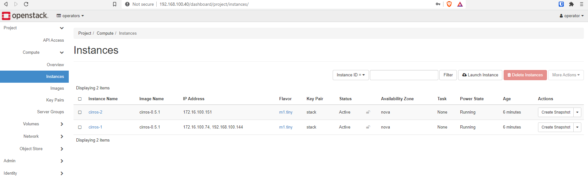

[Part 1](/posts/openstack/deploying-rdo-openstack-in-a-cohesive-manner) and [Part 2](/posts/openstack/deploying-rdo-openstack-in-a-cohesive-manner-part-2-overcloud-deployment) of this series walked through deploying OpenStack with Tripleo in my home lab. I originally intended to only have 2 parts. However, they were so long, I thought the series would benefit from a Part 3 to walk through a few OpenStack post configurations and validating that services are functional.

I have posted all the artifacts of this deployment in a GitHub repository available at:
[https://github.com/kjw3/rdo-sbx](https://github.com/kjw3/rdo-sbx)

In this article, I will utilize the OpenStack Unified CLI, but you could accomplish these same things in the OpenStack Dashboard.

## Validating Connection to the Overcloud

First things first, I need to validate connection to the overcloud. I will be working as the stack user on my undercloud.

```
(undercloud) [stack@tripleo ~]$ source overcloudrc
(overcloud) [stack@tripleo ~]$ openstack service list
+----------------------------------+-----------+----------------+
| ID                               | Name      | Type           |
+----------------------------------+-----------+----------------+
| 193eba58b6d74dec868e8ba8304facb2 | placement | placement      |
| 3bb610c2137a42048e2e06c5289d9509 | glance    | image          |
| 415dfa9bb21f47a7a377008b59c2dc2f | heat-cfn  | cloudformation |
| 7c00ce0afee44187b524a2cdbfc30cb4 | nova      | compute        |
| 8ae19cb031274d2889f63e251a4da40f | cinderv2  | volumev2       |
| 91649b083d63412fa3dd54dc3eda467d | swift     | object-store   |
| d31bc4eb9c724d5cabae8cfd441ac3df | heat      | orchestration  |
| db39f1b2fbaf47d0a942c089a9d4fb25 | keystone  | identity       |
| e3a908356eb547f9a2327b8e649b4e3b | octavia   | load-balancer  |
| eba6186fb2d1439699617ab078551714 | cinderv3  | volumev3       |
| fd00b1ca64cc48c0a6f41db3ac56e9cb | neutron   | network        |
+----------------------------------+-----------+----------------+
```

## OpenStack Initial Post Configurations

Here is the basic list of post configurations that I will go through. All of these are to get my OpenStack cloud in an initial, basic, usable state.

* Create a new project
* Increase the quotas on this project
* Create a new admin user
* Modify the default security group in the new project to allow ICMP, TCP and UDP (you probably want to narrow this down to ICMP, SSH, RDP to start)
* Create a keypair for my stack user's SSH public key
* Create default instance flavors
* Create my external neutron network and subnet (with floating IP range)
* Create a private tenant network and subnet in my project
* Create a router with the external network as the gateway and add an interface for my tenant network
* Download and import several Linux cloud images
* Identity Resources

## Create the project and set quotas.

```
(overcloud) [stack@tripleo ~]$ openstack project create operators --description "Project intended for shared resources a
nd testing by Operators" --enable
+-------------+----------------------------------------------------------------+
| Field       | Value                                                          |
+-------------+----------------------------------------------------------------+
| description | Project intended for shared resources and testing by Operators |
| domain_id   | default                                                        |
| enabled     | True                                                           |
| id          | 480f2bf02c234ec49f4c1e2e06511c63                               |
| is_domain   | False                                                          |
| name        | operators                                                      |
| options     | {}                                                             |
| parent_id   | default                                                        |
| tags        | []                                                             |
+-------------+----------------------------------------------------------------+
(overcloud) [stack@tripleo ~]$ openstack quota set --ram 262144 --instances 20 --cores 80 --gigabytes 1000 --volumes 40 operators
```

Next I will create the new user and grant the admin role. (There is an Admin project and user created at deployment time, but I don't like to use them except for these first initial tasks)

```
(overcloud) [stack@tripleo ~]$ openstack user create operator --project operators --password p@ssw0rd --email operator@k
djlab.com --enable
+---------------------+----------------------------------+
| Field               | Value                            |
+---------------------+----------------------------------+
| default_project_id  | 480f2bf02c234ec49f4c1e2e06511c63 |
| domain_id           | default                          |
| email               | operator@kdjlab.com              |
| enabled             | True                             |
| id                  | 8e5197f1d2ae425faa2a1bae198b190e |
| name                | operator                         |
| options             | {}                               |
| password_expires_at | None                             |
+---------------------+----------------------------------+
(overcloud) [stack@tripleo ~]$ openstack role add admin --user operator --project operators
```

Now I want to start acting as the new user. In order to do this, I'll make a copy of the overcloudrc (which is for the admin user) and modify it to fit my needs.

```
(overcloud) [stack@tripleo ~]$ cp /home/stack/overcloudrc /home/stack/operatorrc
(overcloud) [stack@tripleo ~]$ vi operatorrc
#Edit username, password, project name
(overcloud) [stack@tripleo ~]$ cat operatorrc
# Clear any old environment that may conflict.
for key in $( set | awk '{FS="="}  /^OS_/ {print $1}' ); do unset $key ; done
export NOVA_VERSION=1.1
export COMPUTE_API_VERSION=1.1
export OS_USERNAME=operator
export OS_PROJECT_NAME=operators
export OS_USER_DOMAIN_NAME=Default
export OS_PROJECT_DOMAIN_NAME=Default
export OS_NO_CACHE=True
export OS_CLOUDNAME=overcloud
export no_proxy=,10.100.4.81,192.168.100.40
export PYTHONWARNINGS='ignore:Certificate has no, ignore:A true SSLContext object is not available'
export OS_AUTH_TYPE=password
export OS_PASSWORD=p@ssw0rd
export OS_AUTH_URL=http://192.168.100.40:5000
export OS_IDENTITY_API_VERSION=3
export OS_COMPUTE_API_VERSION=2.latest
export OS_IMAGE_API_VERSION=2
export OS_VOLUME_API_VERSION=3
export OS_REGION_NAME=regionOne

# Add OS_CLOUDNAME to PS1
if [ -z "${CLOUDPROMPT_ENABLED:-}" ]; then
    export PS1=${PS1:-""}
    export PS1=\${OS_CLOUDNAME:+"(\$OS_CLOUDNAME)"}\ $PS1
    export CLOUDPROMPT_ENABLED=1
fi
(overcloud) [stack@tripleo ~]$ source operatorrc
```

## Initial Access and Infrastructure Configurations

Now the fun begins :). Each project on creation gets a default security group. This security group is locked down for ingress by default. For testing purposes, I will open ingress up for ICMP, TCP and UDP.

```
(overcloud) [stack@tripleo ~]$ openstack security group rule create --protocol icmp $(openstack security group list --project operators -c ID -f value)
+-------------------+----------------------------------------------------------------------------------------------------------------------------------------------------------------------+
| Field             | Value                                                                                                                                                                |
+-------------------+----------------------------------------------------------------------------------------------------------------------------------------------------------------------+
| created_at        | 2020-09-24T18:07:51Z                                                                                                                                                 |
| description       |                                                                                                                                                                      |
| direction         | ingress                                                                                                                                                              |
| ether_type        | IPv4                                                                                                                                                                 |
| id                | 7a311fb8-6ddd-41de-aa68-e01cae385ac7                                                                                                                                 |
| location          | cloud='', project.domain_id=, project.domain_name='Default', project.id='480f2bf02c234ec49f4c1e2e06511c63', project.name='operators', region_name='regionOne', zone= |
| name              | None                                                                                                                                                                 |
| port_range_max    | None                                                                                                                                                                 |
| port_range_min    | None                                                                                                                                                                 |
| project_id        | 480f2bf02c234ec49f4c1e2e06511c63                                                                                                                                     |
| protocol          | icmp                                                                                                                                                                 |
| remote_group_id   | None                                                                                                                                                                 |
| remote_ip_prefix  | 0.0.0.0/0                                                                                                                                                            |
| revision_number   | 0                                                                                                                                                                    |
| security_group_id | d6bf4753-1c1e-4645-9354-a971e679e77f                                                                                                                                 |
| tags              | []                                                                                                                                                                   |
| updated_at        | 2020-09-24T18:07:51Z                                                                                                                                                 |
+-------------------+----------------------------------------------------------------------------------------------------------------------------------------------------------------------+
(overcloud) [stack@tripleo ~]$ openstack security group rule create --protocol tcp $(openstack security group list --project operators -c ID -f value)
+-------------------+----------------------------------------------------------------------------------------------------------------------------------------------------------------------+
| Field             | Value                                                                                                                                                                |
+-------------------+----------------------------------------------------------------------------------------------------------------------------------------------------------------------+
| created_at        | 2020-09-24T18:08:11Z                                                                                                                                                 |
| description       |                                                                                                                                                                      |
| direction         | ingress                                                                                                                                                              |
| ether_type        | IPv4                                                                                                                                                                 |
| id                | 89ac3d5a-5781-43c7-bb66-f921a8c26f2d                                                                                                                                 |
| location          | cloud='', project.domain_id=, project.domain_name='Default', project.id='480f2bf02c234ec49f4c1e2e06511c63', project.name='operators', region_name='regionOne', zone= |
| name              | None                                                                                                                                                                 |
| port_range_max    | None                                                                                                                                                                 |
| port_range_min    | None                                                                                                                                                                 |
| project_id        | 480f2bf02c234ec49f4c1e2e06511c63                                                                                                                                     |
| protocol          | tcp                                                                                                                                                                  |
| remote_group_id   | None                                                                                                                                                                 |
| remote_ip_prefix  | 0.0.0.0/0                                                                                                                                                            |
| revision_number   | 0                                                                                                                                                                    |
| security_group_id | d6bf4753-1c1e-4645-9354-a971e679e77f                                                                                                                                 |
| tags              | []                                                                                                                                                                   |
| updated_at        | 2020-09-24T18:08:11Z                                                                                                                                                 |
+-------------------+----------------------------------------------------------------------------------------------------------------------------------------------------------------------+
(overcloud) [stack@tripleo ~]$ openstack security group rule create --protocol udp $(openstack security group list --project operators -c ID -f value)
+-------------------+----------------------------------------------------------------------------------------------------------------------------------------------------------------------+
| Field             | Value                                                                                                                                                                |
+-------------------+----------------------------------------------------------------------------------------------------------------------------------------------------------------------+
| created_at        | 2020-09-24T18:08:24Z                                                                                                                                                 |
| description       |                                                                                                                                                                      |
| direction         | ingress                                                                                                                                                              |
| ether_type        | IPv4                                                                                                                                                                 |
| id                | 334b367a-4be4-4edb-8ac5-9502db5c4c69                                                                                                                                 |
| location          | cloud='', project.domain_id=, project.domain_name='Default', project.id='480f2bf02c234ec49f4c1e2e06511c63', project.name='operators', region_name='regionOne', zone= |
| name              | None                                                                                                                                                                 |
| port_range_max    | None                                                                                                                                                                 |
| port_range_min    | None                                                                                                                                                                 |
| project_id        | 480f2bf02c234ec49f4c1e2e06511c63                                                                                                                                     |
| protocol          | udp                                                                                                                                                                  |
| remote_group_id   | None                                                                                                                                                                 |
| remote_ip_prefix  | 0.0.0.0/0                                                                                                                                                            |
| revision_number   | 0                                                                                                                                                                    |
| security_group_id | d6bf4753-1c1e-4645-9354-a971e679e77f                                                                                                                                 |
| tags              | []                                                                                                                                                                   |
| updated_at        | 2020-09-24T18:08:24Z                                                                                                                                                 |
+-------------------+----------------------------------------------------------------------------------------------------------------------------------------------------------------------+
```

Next I am going to import a keypair for our stack user from the undercloud.

```
(overcloud) [stack@tripleo ~]$ openstack keypair create --public-key /home/stack/.ssh/id_rsa.pub stack
+-------------+-------------------------------------------------+
| Field       | Value                                           |
+-------------+-------------------------------------------------+
| fingerprint | 21:a2:34:a3:c9:93:b9:eb:96:90:34:9e:d1:90:df:66 |
| name        | stack                                           |
| type        | ssh                                             |
| user_id     | 8e5197f1d2ae425faa2a1bae198b190e                |
+-------------+-------------------------------------------------+
```

On deployment, there are no default flavors created. There use to be in prior versions. There are not now. So, we'll create them. Feel free to adjust as you see fit.

```
(overcloud) [stack@tripleo ~]$ openstack flavor create --id 1 --ram 256 --disk 1 --vcpus 1 --public m1.tiny
+----------------------------+---------+
| Field                      | Value   |
+----------------------------+---------+
| OS-FLV-DISABLED:disabled   | False   |
| OS-FLV-EXT-DATA:ephemeral  | 0       |
| description                | None    |
| disk                       | 1       |
| extra_specs                | {}      |
| id                         | 1       |
| name                       | m1.tiny |
| os-flavor-access:is_public | True    |
| properties                 |         |
| ram                        | 256     |
| rxtx_factor                | 1.0     |
| swap                       | 0       |
| vcpus                      | 1       |
+----------------------------+---------+
(overcloud) [stack@tripleo ~]$ openstack flavor create --id 2 --ram 2048 --disk 10 --vcpus 1 --public m1.small
+----------------------------+----------+
| Field                      | Value    |
+----------------------------+----------+
| OS-FLV-DISABLED:disabled   | False    |
| OS-FLV-EXT-DATA:ephemeral  | 0        |
| description                | None     |
| disk                       | 10       |
| extra_specs                | {}       |
| id                         | 2        |
| name                       | m1.small |
| os-flavor-access:is_public | True     |
| properties                 |          |
| ram                        | 2048     |
| rxtx_factor                | 1.0      |
| swap                       | 0        |
| vcpus                      | 1        |
+----------------------------+----------+
(overcloud) [stack@tripleo ~]$ openstack flavor create --id 3 --ram 4096 --disk 20 --vcpus 2 --public m1.medium
+----------------------------+-----------+
| Field                      | Value     |
+----------------------------+-----------+
| OS-FLV-DISABLED:disabled   | False     |
| OS-FLV-EXT-DATA:ephemeral  | 0         |
| description                | None      |
| disk                       | 20        |
| extra_specs                | {}        |
| id                         | 3         |
| name                       | m1.medium |
| os-flavor-access:is_public | True      |
| properties                 |           |
| ram                        | 4096      |
| rxtx_factor                | 1.0       |
| swap                       | 0         |
| vcpus                      | 2         |
+----------------------------+-----------+
(overcloud) [stack@tripleo ~]$ openstack flavor create --id 4 --ram 8192 --disk 40 --vcpus 4 --public m1.large
+----------------------------+----------+
| Field                      | Value    |
+----------------------------+----------+
| OS-FLV-DISABLED:disabled   | False    |
| OS-FLV-EXT-DATA:ephemeral  | 0        |
| description                | None     |
| disk                       | 40       |
| extra_specs                | {}       |
| id                         | 4        |
| name                       | m1.large |
| os-flavor-access:is_public | True     |
| properties                 |          |
| ram                        | 8192     |
| rxtx_factor                | 1.0      |
| swap                       | 0        |
| vcpus                      | 4        |
+----------------------------+----------+
(overcloud) [stack@tripleo ~]$ openstack flavor create --id 5 --ram 16384 --disk 80 --vcpus 8 --public m1.xlarge
+----------------------------+-----------+
| Field                      | Value     |
+----------------------------+-----------+
| OS-FLV-DISABLED:disabled   | False     |
| OS-FLV-EXT-DATA:ephemeral  | 0         |
| description                | None      |
| disk                       | 80        |
| extra_specs                | {}        |
| id                         | 5         |
| name                       | m1.xlarge |
| os-flavor-access:is_public | True      |
| properties                 |           |
| ram                        | 16384     |
| rxtx_factor                | 1.0       |
| swap                       | 0         |
| vcpus                      | 8         |
+----------------------------+-----------+
```

In order to get traffic coming into our cloud via Floating IPs, we need an external network. This network should be routable within your lab or internal physical networking. Most admins start with the same external network that was used during deployment. This is what I will do in my lab.

Depending on your network configuration, you may either create an external network as a flat (untagged on br-ex) or as a vlan (tagged on br-ex).

```
(overcloud) [stack@tripleo ~]$ openstack network create --provider-network-type vlan --provider-physical-network datacentre --provider-segment 2100 --external public
+---------------------------+----------------------------------------------------------------------------------------------------------------------------------------------------------------------+
| Field                     | Value                                                                                                                                                                |
+---------------------------+----------------------------------------------------------------------------------------------------------------------------------------------------------------------+
| admin_state_up            | UP                                                                                                                                                                   |
| availability_zone_hints   |                                                                                                                                                                      |
| availability_zones        |                                                                                                                                                                      |
| created_at                | 2020-09-24T18:14:43Z                                                                                                                                                 |
| description               |                                                                                                                                                                      |
| dns_domain                |                                                                                                                                                                      |
| id                        | 79e137d0-e82a-43d2-8bd6-666e20e3afca                                                                                                                                 |
| ipv4_address_scope        | None                                                                                                                                                                 |
| ipv6_address_scope        | None                                                                                                                                                                 |
| is_default                | False                                                                                                                                                                |
| is_vlan_transparent       | None                                                                                                                                                                 |
| location                  | cloud='', project.domain_id=, project.domain_name='Default', project.id='480f2bf02c234ec49f4c1e2e06511c63', project.name='operators', region_name='regionOne', zone= |
| mtu                       | 1500                                                                                                                                                                 |
| name                      | public                                                                                                                                                               |
| port_security_enabled     | True                                                                                                                                                                 |
| project_id                | 480f2bf02c234ec49f4c1e2e06511c63                                                                                                                                     |
| provider:network_type     | vlan                                                                                                                                                                 |
| provider:physical_network | datacentre                                                                                                                                                           |
| provider:segmentation_id  | 2100                                                                                                                                                                 |
| qos_policy_id             | None                                                                                                                                                                 |
| revision_number           | 1                                                                                                                                                                    |
| router:external           | External                                                                                                                                                             |
| segments                  | None                                                                                                                                                                 |
| shared                    | False                                                                                                                                                                |
| status                    | ACTIVE                                                                                                                                                               |
| subnets                   |                                                                                                                                                                      |
| tags                      |                                                                                                                                                                      |
| updated_at                | 2020-09-24T18:14:43Z                                                                                                                                                 |
+---------------------------+----------------------------------------------------------------------------------------------------------------------------------------------------------------------+

#Create the external subnet
(overcloud) [stack@tripleo ~]$ neutron subnet-create public 192.168.100.0/24 --name public-sub --disable-dhcp --allocation-pool=start=192.168.100.100,end=192.168.100.149 --gateway=192.168.100.1 --dns-nameserver 1
0.99.99.12
neutron CLI is deprecated and will be removed in the future. Use openstack CLI instead.
Created a new subnet:
+-------------------+--------------------------------------------------------+
| Field             | Value                                                  |
+-------------------+--------------------------------------------------------+
| allocation_pools  | {"start": "192.168.100.100", "end": "192.168.100.149"} |
| cidr              | 192.168.100.0/24                                       |
| created_at        | 2020-09-24T18:24:03Z                                   |
| description       |                                                        |
| dns_nameservers   | 10.99.99.12                                            |
| enable_dhcp       | False                                                  |
| gateway_ip        | 192.168.100.1                                          |
| host_routes       |                                                        |
| id                | 0cfe9f85-1caa-4f2a-9f36-ffa95b210418                   |
| ip_version        | 4                                                      |
| ipv6_address_mode |                                                        |
| ipv6_ra_mode      |                                                        |
| name              | public-sub                                             |
| network_id        | 79e137d0-e82a-43d2-8bd6-666e20e3afca                   |
| project_id        | 480f2bf02c234ec49f4c1e2e06511c63                       |
| revision_number   | 0                                                      |
| segment_id        |                                                        |
| service_types     |                                                        |
| subnetpool_id     |                                                        |
| tags              |                                                        |
| tenant_id         | 480f2bf02c234ec49f4c1e2e06511c63                       |
| updated_at        | 2020-09-24T18:24:03Z                                   |
+-------------------+--------------------------------------------------------+
```

Now to create the first private tenant network. This network will only be usable inside of the operators project.

```
(overcloud) [stack@tripleo ~]$ openstack network create private
+---------------------------+----------------------------------------------------------------------------------------------------------------------------------------------------------------------+
| Field                     | Value                                                                                                                                                                |
+---------------------------+----------------------------------------------------------------------------------------------------------------------------------------------------------------------+
| admin_state_up            | UP                                                                                                                                                                   |
| availability_zone_hints   |                                                                                                                                                                      |
| availability_zones        |                                                                                                                                                                      |
| created_at                | 2020-09-24T18:25:21Z                                                                                                                                                 |
| description               |                                                                                                                                                                      |
| dns_domain                |                                                                                                                                                                      |
| id                        | 61751607-0271-4d05-8740-1a095d0e6ff2                                                                                                                                 |
| ipv4_address_scope        | None                                                                                                                                                                 |
| ipv6_address_scope        | None                                                                                                                                                                 |
| is_default                | False                                                                                                                                                                |
| is_vlan_transparent       | None                                                                                                                                                                 |
| location                  | cloud='', project.domain_id=, project.domain_name='Default', project.id='480f2bf02c234ec49f4c1e2e06511c63', project.name='operators', region_name='regionOne', zone= |
| mtu                       | 1442                                                                                                                                                                 |
| name                      | private                                                                                                                                                              |
| port_security_enabled     | True                                                                                                                                                                 |
| project_id                | 480f2bf02c234ec49f4c1e2e06511c63                                                                                                                                     |
| provider:network_type     | geneve                                                                                                                                                               |
| provider:physical_network | None                                                                                                                                                                 |
| provider:segmentation_id  | 2                                                                                                                                                                    |
| qos_policy_id             | None                                                                                                                                                                 |
| revision_number           | 1                                                                                                                                                                    |
| router:external           | Internal                                                                                                                                                             |
| segments                  | None                                                                                                                                                                 |
| shared                    | False                                                                                                                                                                |
| status                    | ACTIVE                                                                                                                                                               |
| subnets                   |                                                                                                                                                                      |
| tags                      |                                                                                                                                                                      |
| updated_at                | 2020-09-24T18:25:21Z                                                                                                                                                 |
+---------------------------+----------------------------------------------------------------------------------------------------------------------------------------------------------------------+

#Create a private subnet
(overcloud) [stack@tripleo ~]$ neutron subnet-create private 172.16.100.0/24 --name private-sub --dns-nameserver 10.99.99.12
neutron CLI is deprecated and will be removed in the future. Use openstack CLI instead.
Created a new subnet:
+-------------------+----------------------------------------------------+
| Field             | Value                                              |
+-------------------+----------------------------------------------------+
| allocation_pools  | {"start": "172.16.100.2", "end": "172.16.100.254"} |
| cidr              | 172.16.100.0/24                                    |
| created_at        | 2020-09-24T18:27:52Z                               |
| description       |                                                    |
| dns_nameservers   | 10.99.99.12                                        |
| enable_dhcp       | True                                               |
| gateway_ip        | 172.16.100.1                                       |
| host_routes       |                                                    |
| id                | 57ea7b0d-6099-4bfd-9e86-7be850692de0               |
| ip_version        | 4                                                  |
| ipv6_address_mode |                                                    |
| ipv6_ra_mode      |                                                    |
| name              | private-sub                                        |
| network_id        | 61751607-0271-4d05-8740-1a095d0e6ff2               |
| project_id        | 480f2bf02c234ec49f4c1e2e06511c63                   |
| revision_number   | 0                                                  |
| segment_id        |                                                    |
| service_types     |                                                    |
| subnetpool_id     |                                                    |
| tags              |                                                    |
| tenant_id         | 480f2bf02c234ec49f4c1e2e06511c63                   |
| updated_at        | 2020-09-24T18:27:52Z                               |
+-------------------+----------------------------------------------------+
```

At this point, I have an external network and a single private tenant network. In order to connect these, I need a neutron router, add an interface for the tenant network and set the gateway to the external network.

```
(overcloud) [stack@tripleo ~]$ neutron router-create router-public
neutron CLI is deprecated and will be removed in the future. Use openstack CLI instead.
Created a new router:
+-------------------------+--------------------------------------+
| Field                   | Value                                |
+-------------------------+--------------------------------------+
| admin_state_up          | True                                 |
| availability_zone_hints |                                      |
| availability_zones      |                                      |
| created_at              | 2020-09-24T18:30:14Z                 |
| description             |                                      |
| external_gateway_info   |                                      |
| id                      | d7c98835-22cd-466b-ae14-dff8268b5b5e |
| name                    | router-public                        |
| project_id              | 480f2bf02c234ec49f4c1e2e06511c63     |
| revision_number         | 1                                    |
| routes                  |                                      |
| status                  | ACTIVE                               |
| tags                    |                                      |
| tenant_id               | 480f2bf02c234ec49f4c1e2e06511c63     |
| updated_at              | 2020-09-24T18:30:14Z                 |
+-------------------------+--------------------------------------+

#Add the interface for the tenant network
(overcloud) [stack@tripleo ~]$ neutron router-interface-add router-public private-sub
neutron CLI is deprecated and will be removed in the future. Use openstack CLI instead.
Added interface 771ed3dc-bb72-4ca3-99ff-21fe7c9f7a17 to router router-public.

#set the external gateway
(overcloud) [stack@tripleo ~]$ neutron router-gateway-set router-public public
neutron CLI is deprecated and will be removed in the future. Use openstack CLI instead.
Set gateway for router router-public
```

## Getting Cloud Images

Now we are ready to populate our image service with a few usable Linux cloud images. Most Linux distributions offer a cloud image in qcow2 format. This is an awesome way to get to immediately working. You can build your own image, but it is great to have these cloud images available. OpenStack maintains a nice page with links to [commonly used cloud images](https://docs.openstack.org/image-guide/obtain-images.html). Depending on your network speed, this may take a little while.

```
(overcloud) [stack@tripleo ~]$ mkdir -p /home/stack/overcloud_guest_images
(overcloud) [stack@tripleo ~]$ curl https://content.kdjlab.com/public/cirros-0.5.1-x86_64-disk.img -o /home/stack/overcloud_guest_images/cirros-0.5.1-x86_64-disk.img
  % Total    % Received % Xferd  Average Speed   Time    Time     Time  Current
                                 Dload  Upload   Total   Spent    Left  Speed
100 15.5M  100 15.5M    0     0  12.4M      0  0:00:01  0:00:01 --:--:-- 12.4M
(overcloud) [stack@tripleo ~]$ curl https://cloud.centos.org/centos/7/images/CentOS-7-x86_64-GenericCloud.qcow2 -o /home/stack/overcloud_guest_images/CentOS-7-x86_64-GenericCloud.qcow2
  % Total    % Received % Xferd  Average Speed   Time    Time     Time  Current
                                 Dload  Upload   Total   Spent    Left  Speed
100  819M  100  819M    0     0   9.8M      0  0:01:23  0:01:23 --:--:-- 17.1M
(overcloud) [stack@tripleo ~]$ curl https://cloud.centos.org/centos/8/x86_64/images/CentOS-8-GenericCloud-8.2.2004-20200611.2.x86_64.qcow2 -o /home/stack/overcloud_guest_images/CentOS-8-GenericCloud-8.2.2004-20200611.2.x86_64.qcow2
  % Total    % Received % Xferd  Average Speed   Time    Time     Time  Current
                                 Dload  Upload   Total   Spent    Left  Speed
100 1111M  100 1111M    0     0  9704k      0  0:01:57  0:01:57 --:--:-- 9821k
(overcloud) [stack@tripleo ~]$ curl http://mirror.siena.edu/fedora/linux/releases/32/Cloud/x86_64/images/Fedora-Cloud-Base-32-1.6.x86_64.qcow2 -o /home/stack/overcloud_guest_images/Fedora-Cloud-Base-32-1.6.x86_64
.qcow2
  % Total    % Received % Xferd  Average Speed   Time    Time     Time  Current
                                 Dload  Upload   Total   Spent    Left  Speed
100  288M  100  288M    0     0  37.5M      0  0:00:07  0:00:07 --:--:-- 36.1M
(overcloud) [stack@tripleo ~]$ curl https://cloud-images.ubuntu.com/releases/bionic/release/ubuntu-18.04-server-cloudimg-amd64.img -o /home/stack/overcloud_guest_images/ubuntu-18.04-server-cloudimg-amd64.img
  % Total    % Received % Xferd  Average Speed   Time    Time     Time  Current
                                 Dload  Upload   Total   Spent    Left  Speed
100  341M  100  341M    0     0  17.3M      0  0:00:19  0:00:19 --:--:-- 30.9M
(overcloud) [stack@tripleo ~]$ curl https://cloud-images.ubuntu.com/releases/focal/release/ubuntu-20.04-server-cloudimg-amd64.img -o /home/stack/overcloud_guest_images/ubuntu-20.04-server-cloudimg-amd64.img
  % Total    % Received % Xferd  Average Speed   Time    Time     Time  Current
                                 Dload  Upload   Total   Spent    Left  Speed
100  520M  100  520M    0     0  11.2M      0  0:00:46  0:00:46 --:--:-- 22.7M
```

Now I will upload all of these to the OpenStack Image service (Glance). I recommend setting minimum disk and ram settings on your images to prevent failures by selecting flavors that are under resourced. I'll just show the output of one of the uploads and just the commands for the rest (the output is pretty long).

```
(overcloud) [stack@tripleo ~]$ openstack image create --container-format bare --disk-format qcow2 --min-disk 1 --min-ram 64 --file /home/stack/overcloud_guest_images/cirros-0.5.1-x86_64-disk.img --public cirros-0.5.1
+------------------+------------------------------------------------------------------------------------------------------------------------------------------------------------------------------------------------------------------------------------------------------------------------------------------------------------------------------------------------------------------------------------------------------------------------------------------------------------------------------------------------+
| Field            | Value                                                                                                                                                                                                                                                                                                                                                                                                                                                                                          |
+------------------+------------------------------------------------------------------------------------------------------------------------------------------------------------------------------------------------------------------------------------------------------------------------------------------------------------------------------------------------------------------------------------------------------------------------------------------------------------------------------------------------+
| checksum         | 25c96942084f61e008d593b6c2cfda00                                                                                                                                                                                                                                                                                                                                                                                                                                                               |
| container_format | bare                                                                                                                                                                                                                                                                                                                                                                                                                                                                                           |
| created_at       | 2020-09-24T18:46:15Z                                                                                                                                                                                                                                                                                                                                                                                                                                                                           |
| disk_format      | qcow2                                                                                                                                                                                                                                                                                                                                                                                                                                                                                          |
| file             | /v2/images/52af6429-0a7d-4941-8ee3-14fd78f1bc85/file                                                                                                                                                                                                                                                                                                                                                                                                                                           |
| id               | 52af6429-0a7d-4941-8ee3-14fd78f1bc85                                                                                                                                                                                                                                                                                                                                                                                                                                                           |
| min_disk         | 1                                                                                                                                                                                                                                                                                                                                                                                                                                                                                              |
| min_ram          | 64                                                                                                                                                                                                                                                                                                                                                                                                                                                                                             |
| name             | cirros-0.5.1                                                                                                                                                                                                                                                                                                                                                                                                                                                                                   |
| owner            | 480f2bf02c234ec49f4c1e2e06511c63                                                                                                                                                                                                                                                                                                                                                                                                                                                               |
| properties       | direct_url='rbd://6b7b96af-2c42-410e-a0c7-5f75298635c2/images/52af6429-0a7d-4941-8ee3-14fd78f1bc85/snap', locations='[{'url': 'rbd://6b7b96af-2c42-410e-a0c7-5f75298635c2/images/52af6429-0a7d-4941-8ee3-14fd78f1bc85/snap', 'metadata': {'store': 'default_backend'}}]', os_hash_algo='sha512', os_hash_value='c0fcc2610fafb2628071cd18c90fe552332b00be0df5ec481c2a06d42d831f7d485e337cf50e1fad5bb5d86c81451f1d907156343bf2856e349079157f7da400', os_hidden='False', stores='default_backend' |
| protected        | False                                                                                                                                                                                                                                                                                                                                                                                                                                                                                          |
| schema           | /v2/schemas/image                                                                                                                                                                                                                                                                                                                                                                                                                                                                              |
| size             | 273                                                                                                                                                                                                                                                                                                                                                                                                                                                                                            |
| status           | active                                                                                                                                                                                                                                                                                                                                                                                                                                                                                         |
| tags             |                                                                                                                                                                                                                                                                                                                                                                                                                                                                                                |
| updated_at       | 2020-09-24T18:46:15Z                                                                                                                                                                                                                                                                                                                                                                                                                                                                           |
| virtual_size     | None                                                                                                                                                                                                                                                                                                                                                                                                                                                                                           |
| visibility       | public                                                                                                                                                                                                                                                                                                                                                                                                                                                                                         |
+------------------+------------------------------------------------------------------------------------------------------------------------------------------------------------------------------------------------------------------------------------------------------------------------------------------------------------------------------------------------------------------------------------------------------------------------------------------------------------------------------------------------+

(overcloud) [stack@tripleo ~]$ openstack image create --container-format bare --disk-format qcow2 --min-disk 10 --min-ram 2048 --file /home/stack/overcloud_guest_images/CentOS-7-x86_64-GenericCloud.qcow2 --public centos-7
(overcloud) [stack@tripleo ~]$ openstack image create --container-format bare --disk-format qcow2 --min-disk 10 --min-ram 2048 --file /home/stack/overcloud_guest_images/CentOS-8-GenericCloud-8.2.2004-20200611.2.x86_64.qcow2 --public centos-8
(overcloud) [stack@tripleo ~]$ openstack image create --container-format bare --disk-format qcow2 --min-disk 10 --min-ram 2048 --file /home/stack/overcloud_guest_images/Fedora-Cloud-Base-32-1.6.x86_64.qcow2 --public fedora-32
(overcloud) [stack@tripleo ~]$ openstack image create --container-format bare --disk-format qcow2 --min-disk 10 --min-ram 2048 --file /home/stack/overcloud_guest_images/ubuntu-18.04-server-cloudimg-amd64.img --public ubuntu-18.04
(overcloud) [stack@tripleo ~]$ openstack image create --container-format bare --disk-format qcow2 --min-disk 10 --min-ram 2048 --file /home/stack/overcloud_guest_images/ubuntu-20.04-server-cloudimg-amd64.img --public ubuntu-20.04

(overcloud) [stack@tripleo ~]$ openstack image list
+--------------------------------------+--------------+--------+
| ID                                   | Name         | Status |
+--------------------------------------+--------------+--------+
| e94feaf6-daae-4eba-8b3a-48a7d7e3dc06 | centos-7     | active |
| 9f12560c-9b9f-463e-b881-bcf5bb3cc2ff | centos-8     | active |
| 52af6429-0a7d-4941-8ee3-14fd78f1bc85 | cirros-0.5.1 | active |
| d5c32eaf-d2ee-42e3-9b56-543c668d8653 | fedora-32    | active |
| a74287c0-2fa8-4639-b53a-5261755afed9 | ubuntu-18.04 | active |
| 664cf273-a54e-4775-a477-3951f72b9050 | ubuntu-20.04 | active |
+--------------------------------------+--------------+--------+
```

After all this, I am now ready to deploy a virtual instance on this OpenStack cloud. Before we do that, I included a bash script in the artifact repository that does everything I just did with a single command.

You need to edit the values at the top of the script before you run it to match your environment.

```
(overcloud) [stack@tripleo ~]$ ./overcloudPostConfig.sh
```

## Launching an OpenStack Virtual Instance

> NOTE: I did hit an SELinux permission denial on the hypervisors. For this I filed [bugzilla 1882922](https://bugzilla.redhat.com/show_bug.cgi?id=1882922). I have added a [workaround script](https://raw.githubusercontent.com/kjw3/rdo-sbx/master/podman-update.sh) that you can execute on your nova computes to fix this issue.

```
(undercloud) [stack@tripleo rdo-sbx]$ openstack server list
+--------------------------------------+-------------------------+--------+----------------------+----------------+------------+
| ID                                   | Name                    | Status | Networks             | Image          | Flavor     |
+--------------------------------------+-------------------------+--------+----------------------+----------------+------------+
| 9c29c973-c72f-43a3-b6e1-b062925910ea | overcloud-controller-1  | ACTIVE | ctlplane=10.100.4.81 | overcloud-full | control    |
| bea7c10f-f85e-4b21-bffc-a713c3467467 | overcloud-controller-2  | ACTIVE | ctlplane=10.100.4.87 | overcloud-full | control    |
| 3238e7b5-eec7-4ff4-951c-652a79b4dc9c | overcloud-controller-0  | ACTIVE | ctlplane=10.100.4.77 | overcloud-full | control    |
| 78022df8-4d6e-4d6c-a44d-dc7327b78474 | overcloud-computehci-2  | ACTIVE | ctlplane=10.100.4.76 | overcloud-full | computeHCI |
| d010afd4-39d3-4b60-89d3-79334549a317 | overcloud-computehci-0  | ACTIVE | ctlplane=10.100.4.78 | overcloud-full | computeHCI |
| a544464e-c2b2-4ba7-a4d7-b9c70ad1c8f3 | overcloud-computehci-1  | ACTIVE | ctlplane=10.100.4.80 | overcloud-full | computeHCI |
| 067589fc-3b29-46bd-a54a-d0f1febe0c5d | overcloud-novacompute-0 | ACTIVE | ctlplane=10.100.4.75 | overcloud-full | compute    |
| d79c5023-f883-465b-a8b6-aa9f174d38e7 | overcloud-novacompute-1 | ACTIVE | ctlplane=10.100.4.79 | overcloud-full | compute    |
+--------------------------------------+-------------------------+--------+----------------------+----------------+------------+

#Execute the podman-update script against your nova computes
(undercloud) [stack@tripleo rdo-sbx]$ for i in {76,78,80,75,79}; do ssh heat-admin@10.100.4.$i ./rdo-sbx/podman-update.sh ; done

#You can validate the changes with the following loop
(undercloud) [stack@tripleo rdo-sbx]$ for i in {76,78,80,75,79}; do ssh heat-admin@10.100.4.$i 'getenforce; rpm -qa podman; cat /etc/selinux/config; sudo podman ps | grep -i libvirt;' ; done 
```

Time to try creating a virtual instance. I always like to create two to start. Using the Cirros image is small and a good way to test connectivity. I like to associate a floating IP to one of the instances and leave the other without a floating IP. This allows me to connect to the first one, jump to the second one and validated ingress and egress communications.

```
(overcloud) [stack@tripleo rdo-sbx]$ openstack server create --image cirros-0.5.1 --flavor m1.tiny --key-name stack --network private --min 1 --max 2 cirros
+-------------------------------------+------------------------------------------------------------------------------------+
| Field                               | Value                                                                              |
+-------------------------------------+------------------------------------------------------------------------------------+
| OS-DCF:diskConfig                   | MANUAL                                                                             |
| OS-EXT-AZ:availability_zone         |                                                                                    |
| OS-EXT-SRV-ATTR:host                | None                                                                               |
| OS-EXT-SRV-ATTR:hostname            | cirros-1                                                                           |
| OS-EXT-SRV-ATTR:hypervisor_hostname | None                                                                               |
| OS-EXT-SRV-ATTR:instance_name       |                                                                                    |
| OS-EXT-SRV-ATTR:kernel_id           |                                                                                    |
| OS-EXT-SRV-ATTR:launch_index        | 0                                                                                  |
| OS-EXT-SRV-ATTR:ramdisk_id          |                                                                                    |
| OS-EXT-SRV-ATTR:reservation_id      | r-0putr8qy                                                                         |
| OS-EXT-SRV-ATTR:root_device_name    | None                                                                               |
| OS-EXT-SRV-ATTR:user_data           | None                                                                               |
| OS-EXT-STS:power_state              | NOSTATE                                                                            |
| OS-EXT-STS:task_state               | scheduling                                                                         |
| OS-EXT-STS:vm_state                 | building                                                                           |
| OS-SRV-USG:launched_at              | None                                                                               |
| OS-SRV-USG:terminated_at            | None                                                                               |
| accessIPv4                          |                                                                                    |
| accessIPv6                          |                                                                                    |
| addresses                           |                                                                                    |
| adminPass                           | WVNSTD6pQhM5                                                                       |
| config_drive                        |                                                                                    |
| created                             | 2020-09-24T22:25:21Z                                                               |
| description                         | None                                                                               |
| flavor                              | disk='1', ephemeral='0', , original_name='m1.tiny', ram='256', swap='0', vcpus='1' |
| hostId                              |                                                                                    |
| host_status                         |                                                                                    |
| id                                  | 400797b3-2e38-4fff-bef8-0e1d48be10aa                                               |
| image                               | cirros-0.5.1 (d0470e5d-9eb1-4788-9b28-51175f5545e7)                                |
| key_name                            | stack                                                                              |
| locked                              | False                                                                              |
| locked_reason                       | None                                                                               |
| name                                | cirros-1                                                                           |
| progress                            | 0                                                                                  |
| project_id                          | 480f2bf02c234ec49f4c1e2e06511c63                                                   |
| properties                          |                                                                                    |
| security_groups                     | name='default'                                                                     |
| server_groups                       | []                                                                                 |
| status                              | BUILD                                                                              |
| tags                                | []                                                                                 |
| trusted_image_certificates          | None                                                                               |
| updated                             | 2020-09-24T22:25:21Z                                                               |
| user_id                             | 8e5197f1d2ae425faa2a1bae198b190e                                                   |
| volumes_attached                    |                                                                                    |
+-------------------------------------+------------------------------------------------------------------------------------+
```

Now associate a Floating IP with the first one.

```
(overcloud) [stack@tripleo ~]$ openstack floating ip create --project operators public
+---------------------+------------------------------------------------------------------------------------------------------------------------------------------------------------------------------------------------+
| Field               | Value                                                                                                                                                                                          |
+---------------------+------------------------------------------------------------------------------------------------------------------------------------------------------------------------------------------------+
| created_at          | 2020-09-24T19:16:49Z                                                                                                                                                                           |
| description         |                                                                                                                                                                                                |
| dns_domain          |                                                                                                                                                                                                |
| dns_name            |                                                                                                                                                                                                |
| fixed_ip_address    | None                                                                                                                                                                                           |
| floating_ip_address | 192.168.100.144                                                                                                                                                                                |
| floating_network_id | 79e137d0-e82a-43d2-8bd6-666e20e3afca                                                                                                                                                           |
| id                  | b8eaf6a5-4b77-4c8e-82bc-97669e42399b                                                                                                                                                           |
| location            | Munch({'cloud': '', 'region_name': 'regionOne', 'zone': None, 'project': Munch({'id': '480f2bf02c234ec49f4c1e2e06511c63', 'name': 'operators', 'domain_id': None, 'domain_name': 'Default'})}) |
| name                | 192.168.100.144                                                                                                                                                                                |
| port_details        | None                                                                                                                                                                                           |
| port_id             | None                                                                                                                                                                                           |
| project_id          | 480f2bf02c234ec49f4c1e2e06511c63                                                                                                                                                               |
| qos_policy_id       | None                                                                                                                                                                                           |
| revision_number     | 0                                                                                                                                                                                              |
| router_id           | None                                                                                                                                                                                           |
| status              | DOWN                                                                                                                                                                                           |
| subnet_id           | None                                                                                                                                                                                           |
| tags                | []                                                                                                                                                                                             |
| updated_at          | 2020-09-24T19:16:49Z                                                                                                                                                                           |
+---------------------+------------------------------------------------------------------------------------------------------------------------------------------------------------------------------------------------+
```

Next associate the Floating IP with the cirros-1 instance.

```
(overcloud) [stack@tripleo ~]$ openstack server add floating ip cirros-1 192.168.100.144
```

Lastly validate connectivity into cirros-1 from the undercloud. Jump to cirros-2. Make sure that egress and name resolution is working inside cirros-2 which is only on the tenant network with no Floating IP.

```
(overcloud) [stack@tripleo ~]$ ssh cirros@192.168.100.144
The authenticity of host '192.168.100.144 (192.168.100.144)' can't be established.
ECDSA key fingerprint is SHA256:D52mjVPOu1F4tIAsoHBgstgl7ybEHugt+6ZFAyfdn0w.
Are you sure you want to continue connecting (yes/no/[fingerprint])? yes
Warning: Permanently added '192.168.100.144' (ECDSA) to the list of known hosts.
$ hostname
cirros-1
$ ip a
1: lo: <LOOPBACK,UP,LOWER_UP> mtu 65536 qdisc noqueue qlen 1000
    link/loopback 00:00:00:00:00:00 brd 00:00:00:00:00:00
    inet 127.0.0.1/8 scope host lo
       valid_lft forever preferred_lft forever
    inet6 ::1/128 scope host
       valid_lft forever preferred_lft forever
2: eth0: <BROADCAST,MULTICAST,UP,LOWER_UP> mtu 1442 qdisc pfifo_fast qlen 1000
    link/ether fa:16:3e:99:7a:09 brd ff:ff:ff:ff:ff:ff
    inet 172.16.100.74/24 brd 172.16.100.255 scope global eth0
       valid_lft forever preferred_lft forever
    inet6 fe80::f816:3eff:fe99:7a09/64 scope link
       valid_lft forever preferred_lft forever
$ ping kdjlab.com
PING kdjlab.com (100.4.110.14): 56 data bytes
64 bytes from 100.4.110.14: seq=0 ttl=63 time=0.987 ms
64 bytes from 100.4.110.14: seq=1 ttl=63 time=0.864 ms
64 bytes from 100.4.110.14: seq=2 ttl=63 time=0.551 ms
64 bytes from 100.4.110.14: seq=3 ttl=63 time=0.528 ms
^C
--- kdjlab.com ping statistics ---
4 packets transmitted, 4 packets received, 0% packet loss
round-trip min/avg/max = 0.528/0.732/0.987 ms
```

So I have access to the cirros-1 instance that I associated the 192.168.100.144 Floating IP with via SSH (with stack's SSH key pair). This means ingress is working as expected.

I can also ping out to kdjlab.com which is a public IP address and prove that both internet egress and name resolution is working in the cirros-1 instance.

Now I will jump to the cirros-2 instance which does not have a Floating IP and is only reachable from the private tenant subnet.

```
$ ssh cirros@172.16.100.151
Host '172.16.100.151' is not in the trusted hosts file.
(ecdsa-sha2-nistp256 fingerprint sha1!! c5:23:61:3a:26:38:df:01:c4:3a:17:6b:61:a7:67:87:05:06:0b:f4)
Do you want to continue connecting? (y/n) y
cirros@172.16.100.151's password:

$ hostname
cirros-2

$ ip r
default via 172.16.100.1 dev eth0
169.254.169.254 via 172.16.100.2 dev eth0
172.16.100.0/24 dev eth0 scope link  src 172.16.100.151

$ ping -c 4 kdjlab.com
PING kdjlab.com (100.4.110.14): 56 data bytes
64 bytes from 100.4.110.14: seq=0 ttl=63 time=1.544 ms
64 bytes from 100.4.110.14: seq=1 ttl=63 time=1.336 ms
64 bytes from 100.4.110.14: seq=2 ttl=63 time=0.803 ms
64 bytes from 100.4.110.14: seq=3 ttl=63 time=0.958 ms

--- kdjlab.com ping statistics ---
4 packets transmitted, 4 packets received, 0% packet loss
round-trip min/avg/max = 0.803/1.160/1.544 ms
```

## Conclusion

At the end of this 3 part series, I have deployed an OpenStack Train cloud using RDO TripleO. The deployment of the overcloud was completely abstracted into a git repository and automated by the TripleO tooling. I then did some final basic setup of projects, users, flavors, networking, images and was able to launch fully functioning Linux virtual instances to show that the cloud is stable and usable.

OpenStack has come a long way in the last 10 years and is an extremely flexible and powerful way to turn physical servers into a functional API driven cloud infrastructure.