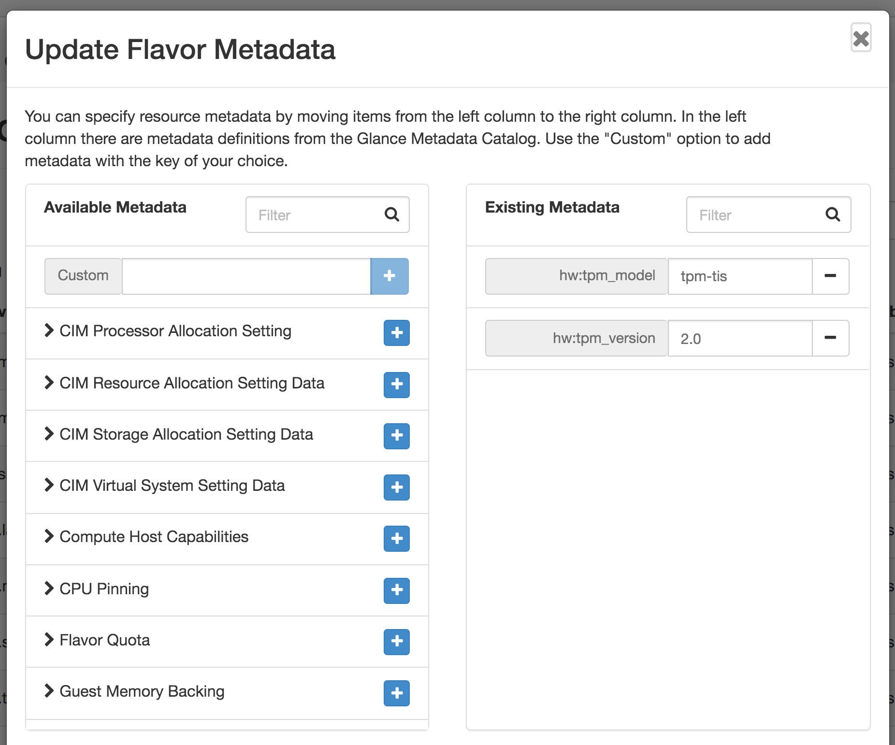

Recently I have been working on customizing my OpenStack lab deployment to allow for some testing use cases.

Some of these use cases require a TPM be available in the test system. I wanted to utilize virtual machines in order to iterate faster and have more flexibility.

In OpenStack Victoria, they have added the capability to create virtual TPM devices for instances.

[https://docs.openstack.org/nova/latest/admin/emulated-tpm.html](https://docs.openstack.org/nova/latest/admin/emulated-tpm.html)

I am deploying my lab with TripleO and it appeared that the developers had implemented the ability to enable this vTPM feature. You'll see that I still had some work to do to get vTPM working in my lab.

## Modify Deployment Templates

Modifying the tripleo-heat-templates to enable vTPM in Nova is simple. You need to add one parameter and rerun your deployment. I have a catch-all environment file named node-info.yaml where I place all my parameters that aren't in a matching file that comes from /usr/share/openstack-tripleo-heat-templates on the undercloud.

```
parameter_defaults:
  ...
  NovaEnableVTPM: true
```

It would be awesome if adding the parameter above made the deployment work with all the pieces needed for vTPM functionality. However, that was not my experience. I believe the end goal is for that to be the case, but not everything is done yet (unless I missed something).

## TripleO Nova Containers

There are two containers that matter for vTPM to work (openstack-nova-compute and openstack-nova-libvirt).

The Victoria version of openstack-nova-libvirt has swtpm and trousers installed. However, there is still one piece missing, swtpm-tools. swtpm-tools provides the swtpm_setup binary.

The Victoria version of openstack-nova-compute does not have any of these three packages installed.

For the time being, I needed to modify these two containers with the correct packages to get my deployment working with vTPM.

I figured this stuff out by many days of trying things, seeing errors like swtpm not on path, no user tss, or swtpm_setup not on path errors trying to launch instances.

I accomplished modifying the container images by using the [ansible-role-tripleo-modify-image](https://github.com/openstack/ansible-role-tripleo-modify-image) Ansible role.

> NOTE: You need to build the new containers on an entitled RHEL system with buildah and podamn installed, because the tripleo container images are based on RHEL UBI.

To use this role, create a working directory.

```
[cloud-user@rhel8-image-builder ~]$ mkdir openstack-nova-compute
[cloud-user@rhel8-image-builder ~]$ cd openstack-nova-compute
[cloud-user@rhel8-image-builder openstack-nova-compute]$
```

Clone the Ansible role.

```
[cloud-user@rhel8-image-builder openstack-nova-compute]$ git clone https://github.com/openstack/ansible-role-tripleo-modify-image.git
Cloning into 'ansible-role-tripleo-modify-image'...
remote: Enumerating objects: 21, done.
remote: Counting objects: 100% (21/21), done.
remote: Compressing objects: 100% (15/15), done.
remote: Total 622 (delta 6), reused 16 (delta 4), pack-reused 601
Receiving objects: 100% (622/622), 98.60 KiB | 5.19 MiB/s, done.
Resolving deltas: 100% (363/363), done.
```

Create a simple playbook to build the modified container image.

```
[cloud-user@rhel8-image-builder openstack-nova-compute]$ vi nova-compute-swtpm.yml 
- hosts: localhost
  tasks:
  - name: include ansible-role-tripleo-modify-image
    import_role:
      name: ansible-role-tripleo-modify-image
      tasks_from: modify_image.yml
    vars:
      source_image: tripleomaster/openstack-nova-compute:current-tripleo
      modify_dir_path: /home/cloud-user/openstack-nova-compute
      container_build_tool: buildah
```

Now we need a Dockerfile which will express the modifications needed.

```
[cloud-user@rhel8-image-builder openstack-nova-compute]$ vi Dockerfile 
# This will be replaced in the file Dockerfile.modified
FROM openstack-nova-compute

# switch to root to install packages
USER root

# install packages
RUN curl "https://content.kdjlab.com/public/advanced-virtualization.repo" -o "/etc/yum.repos.d/advanced-virtualization.repo"
RUN dnf install -y swtpm trousers swtpm-tools && dnf clean all && rm -rf /var/cache/dnf

#Add user and group for swtpm
USER tss

# switch the container back to the default user
USER nova
```

You'll probably notice that I am pulling down a repo file named advanced-virtualization.repo. This is the CentOS 8 location for swtpm and trousers. You'll want to host your own local copy of this file and change the URL in the Dockerfile to match your location.

```
[advanced-virtualization]
name=Advanced Virtualization mirror
baseurl=http://mirror.centos.org/centos/8/virt/$basearch/advanced-virtualization/
gpgcheck=0
enabled=1
module_hotfixes=1
```

Run the playbook.

```
[cloud-user@rhel8-image-builder openstack-nova-compute]$ ansible-playbook nova-compute-swtpm.yml
```

Once this completes, you'll now have a local copy of the modified image tagged with a timestamp. You can see it by running buildah images.

```
[cloud-user@rhel8-image-builder openstack-nova-compute]$ sudo buildah images
REPOSITORY                                       TAG                                       IMAGE ID       CREATED        SIZE
localhost/tripleomaster/openstack-nova-compute   current-tripleo-modified-20201028213253   84264f5e20ab   4 days ago     2.32 GB
docker.io/tripleomaster/openstack-nova-compute   current-tripleo                           99f558f0e9e9   9 days ago     2.22 GB
```

Lastly we need to push this out to a registry. I used Docker Hub. Create a repository to hold your image.

Authenticate to Docker Hub, then push.

```
[cloud-user@rhel8-image-builder openstack-nova-compute]$ sudo buildah login docker.io
... #enter username and password
[cloud-user@rhel8-image-builder openstack-nova-compute]$ sudo buildah push --debug localhost/tripleomaster/openstack-nova-compute:current-tripleo-modified-20201028213253 docker://docker.io/kjw3/openstack-nova-compute:victoria-swtpm
```

[https://hub.docker.com/repository/docker/kjw3/openstack-nova-compute](https://hub.docker.com/repository/docker/kjw3/openstack-nova-compute)

If you examine the commands that made the latest tag of my container, you'll see:

```
USER root
/bin/sh -c curl "https://content.kdjlab.com/public/advanced-virtualization.repo" -o "/etc/yum.repos.d/advanced-virtualization.repo"
/bin/sh -c dnf install -y swtpm trousers swtpm-tools && dnf clean all && rm -rf /var/cache/dnf
USER tss
USER nova
```

This matches my Dockerfile.

You need to repeat this process for the openstack-nova-libvirt container image. Change occurrences of openstack-nova-compute for openstack-nova-libvirt in the steps above. There is one minor difference in the Dockerfile. openstack-nova-libvirt runs as root. The Dockerfile I used for it is below. Notice I only installed swtpm-tools too because swtpm and trousers was already installed in this container.

```
[cloud-user@rhel8-image-builder openstack-nova-libvirt]$ cat Dockerfile
# This will be replaced in the file Dockerfile.modified
FROM openstack-nova-libvirt

# switch to root to install packages
USER root

# install packages
RUN curl "https://content.kdjlab.com/public/advanced-virtualization.repo" -o "/etc/yum.repos.d/advanced-virtualization.repo"
RUN dnf install -y swtpm-tools && dnf clean all && rm -rf /var/cache/dnf

#Add user and group for swtpm
USER tss

# switch the container back to the default user
USER root
```

## Modify Deployment Templates to Use the New Containers

We now need to add two parameters to tell the overcloud deployment what images to user for Nova Compute and Nova Libvirt. I added these to my node-info.yaml environment file.

```
parameter_defaults:
  ...
  ContainerNovaComputeImage: docker.io/kjw3/openstack-nova-compute:victoria-swtpm
  ContainerNovaLibvirtImage: docker.io/kjw3/openstack-nova-libvirt:victoria-swtpm
```

Rerun the deployment now.

```
(undercloud) [stack@tripleo-victoria ~]$ ./deploy.sh
...
```

On your compute hosts, you will see that nova_compute and nova_libvirt containers are using the new images.

```
[heat-admin@overcloud-compute-0 ~]$ sudo podman ps | grep nova
20e2be971930  docker.io/kjw3/openstack-nova-compute:victoria-swtpm                                                          kolla_start           15 hours ago  Up 15 hours ago         nova_compute
8e632b9a150f  docker.io/kjw3/openstack-nova-libvirt:victoria-swtpm                                                          kolla_start           15 hours ago  Up 15 hours ago         nova_libvirt
27304d15b145  docker.io/kjw3/openstack-nova-libvirt:victoria-swtpm                                                          kolla_start           15 hours ago  Up 15 hours ago         nova_virtlogd
9f64b5a402cb  docker.io/kjw3/openstack-nova-compute:victoria-swtpm                                                          kolla_start           2 days ago    Up 2 days ago           nova_migration_target
```

Are we there yet? I wish. I found out that even with the new containers in place, there is one final missing component. SELinux. The work is still in progress. Below is the output from setroubleshoot for the SELinux denials.

```
(undercloud) [stack@tripleo-victoria ~]$ cat swtpm-selinux-issues 

found 4 alerts in /var/log/audit/audit.log
--------------------------------------------------------------------------------

SELinux is preventing swtpm from write access on the directory swtpm.

*****  Plugin qemu_file_image (98.8 confidence) suggests   *******************

If swtpm is a virtualization target
Then you need to change the label on swtpm'
Do
# semanage fcontext -a -t virt_image_t 'swtpm'
# restorecon -v 'swtpm'

*****  Plugin catchall (2.13 confidence) suggests   **************************

If you believe that swtpm should be allowed write access on the swtpm directory by default.
Then you should report this as a bug.
You can generate a local policy module to allow this access.
Do
allow this access for now by executing:
# ausearch -c 'swtpm' --raw | audit2allow -M my-swtpm
# semodule -X 300 -i my-swtpm.pp


Additional Information:
Source Context                system_u:system_r:svirt_t:s0:c38,c260
Target Context                system_u:object_r:container_file_t:s0
Target Objects                swtpm [ dir ]
Source                        swtpm
Source Path                   swtpm
Port                          <Unknown>
Host                          <Unknown>
Source RPM Packages           
Target RPM Packages           
Policy RPM                    selinux-policy-3.14.3-41.el8_2.6.noarch
Selinux Enabled               True
Policy Type                   targeted
Enforcing Mode                Permissive
Host Name                     overcloud-controller-1
Platform                      Linux overcloud-controller-1
                              4.18.0-193.19.1.el8_2.x86_64 #1 SMP Mon Sep 14
                              14:37:00 UTC 2020 x86_64 x86_64
Alert Count                   1
First Seen                    2020-11-01 06:25:41 EST
Last Seen                     2020-11-01 06:25:41 EST
Local ID                      b088198d-ac2b-45a0-ac8a-354bcc3c51ac

Raw Audit Messages
type=AVC msg=audit(1604229941.636:2391008): avc:  denied  { write } for  pid=452433 comm="swtpm" name="swtpm" dev="tmpfs" ino=510589704 scontext=system_u:system_r:svirt_t:s0:c38,c260 tcontext=system_u:object_r:container_file_t:s0 tclass=dir permissive=1


type=AVC msg=audit(1604229941.636:2391008): avc:  denied  { add_name } for  pid=452433 comm="swtpm" name="1-instance-0000005a-swtpm.sock" scontext=system_u:system_r:svirt_t:s0:c38,c260 tcontext=system_u:object_r:container_file_t:s0 tclass=dir permissive=1


type=AVC msg=audit(1604229941.636:2391008): avc:  denied  { create } for  pid=452433 comm="swtpm" name="1-instance-0000005a-swtpm.sock" scontext=system_u:system_r:svirt_t:s0:c38,c260 tcontext=system_u:object_r:container_file_t:s0 tclass=sock_file permissive=1


Hash: swtpm,svirt_t,container_file_t,dir,write

--------------------------------------------------------------------------------

SELinux is preventing swtpm from setattr access on the sock_file 1-instance-0000005a-swtpm.sock.

*****  Plugin catchall (100. confidence) suggests   **************************

If you believe that swtpm should be allowed setattr access on the 1-instance-0000005a-swtpm.sock sock_file by default.
Then you should report this as a bug.
You can generate a local policy module to allow this access.
Do
allow this access for now by executing:
# ausearch -c 'swtpm' --raw | audit2allow -M my-swtpm
# semodule -X 300 -i my-swtpm.pp


Additional Information:
Source Context                system_u:system_r:svirt_t:s0:c38,c260
Target Context                system_u:object_r:container_file_t:s0
Target Objects                1-instance-0000005a-swtpm.sock [ sock_file ]
Source                        swtpm
Source Path                   swtpm
Port                          <Unknown>
Host                          <Unknown>
Source RPM Packages           
Target RPM Packages           
Policy RPM                    selinux-policy-3.14.3-41.el8_2.6.noarch
Selinux Enabled               True
Policy Type                   targeted
Enforcing Mode                Permissive
Host Name                     overcloud-controller-1
Platform                      Linux overcloud-controller-1
                              4.18.0-193.19.1.el8_2.x86_64 #1 SMP Mon Sep 14
                              14:37:00 UTC 2020 x86_64 x86_64
Alert Count                   1
First Seen                    2020-11-01 06:25:41 EST
Last Seen                     2020-11-01 06:25:41 EST
Local ID                      6ea3df16-9bf2-463e-bc0c-bd1f892eae4e

Raw Audit Messages
type=AVC msg=audit(1604229941.636:2391009): avc:  denied  { setattr } for  pid=452433 comm="swtpm" name="1-instance-0000005a-swtpm.sock" dev="tmpfs" ino=510590763 scontext=system_u:system_r:svirt_t:s0:c38,c260 tcontext=system_u:object_r:container_file_t:s0 tclass=sock_file permissive=1


Hash: swtpm,svirt_t,container_file_t,sock_file,setattr

--------------------------------------------------------------------------------

SELinux is preventing swtpm from append access on the file instance-0000005a-swtpm.log.

*****  Plugin qemu_file_image (98.8 confidence) suggests   *******************

If instance-0000005a-swtpm.log is a virtualization target
Then you need to change the label on instance-0000005a-swtpm.log'
Do
# semanage fcontext -a -t virt_image_t 'instance-0000005a-swtpm.log'
# restorecon -v 'instance-0000005a-swtpm.log'

*****  Plugin catchall (2.13 confidence) suggests   **************************

If you believe that swtpm should be allowed append access on the instance-0000005a-swtpm.log file by default.
Then you should report this as a bug.
You can generate a local policy module to allow this access.
Do
allow this access for now by executing:
# ausearch -c 'swtpm' --raw | audit2allow -M my-swtpm
# semodule -X 300 -i my-swtpm.pp


Additional Information:
Source Context                system_u:system_r:svirt_t:s0:c38,c260
Target Context                system_u:object_r:container_ro_file_t:s0
Target Objects                instance-0000005a-swtpm.log [ file ]
Source                        swtpm
Source Path                   swtpm
Port                          <Unknown>
Host                          <Unknown>
Source RPM Packages           
Target RPM Packages           
Policy RPM                    selinux-policy-3.14.3-41.el8_2.6.noarch
Selinux Enabled               True
Policy Type                   targeted
Enforcing Mode                Permissive
Host Name                     overcloud-controller-1
Platform                      Linux overcloud-controller-1
                              4.18.0-193.19.1.el8_2.x86_64 #1 SMP Mon Sep 14
                              14:37:00 UTC 2020 x86_64 x86_64
Alert Count                   1
First Seen                    2020-11-01 06:25:41 EST
Last Seen                     2020-11-01 06:25:41 EST
Local ID                      0bbe7b10-0e15-4b86-a019-5bd9ec884b3b

Raw Audit Messages
type=AVC msg=audit(1604229941.636:2391010): avc:  denied  { append } for  pid=452433 comm="swtpm" name="instance-0000005a-swtpm.log" dev="overlay" ino=510589703 scontext=system_u:system_r:svirt_t:s0:c38,c260 tcontext=system_u:object_r:container_ro_file_t:s0 tclass=file permissive=1


Hash: swtpm,svirt_t,container_ro_file_t,file,append

--------------------------------------------------------------------------------

SELinux is preventing swtpm from create access on the file 1-instance-0000005a-swtpm.pid.

*****  Plugin catchall (100. confidence) suggests   **************************

If you believe that swtpm should be allowed create access on the 1-instance-0000005a-swtpm.pid file by default.
Then you should report this as a bug.
You can generate a local policy module to allow this access.
Do
allow this access for now by executing:
# ausearch -c 'swtpm' --raw | audit2allow -M my-swtpm
# semodule -X 300 -i my-swtpm.pp


Additional Information:
Source Context                system_u:system_r:svirt_t:s0:c38,c260
Target Context                system_u:object_r:container_file_t:s0
Target Objects                1-instance-0000005a-swtpm.pid [ file ]
Source                        swtpm
Source Path                   swtpm
Port                          <Unknown>
Host                          <Unknown>
Source RPM Packages           
Target RPM Packages           
Policy RPM                    selinux-policy-3.14.3-41.el8_2.6.noarch
Selinux Enabled               True
Policy Type                   targeted
Enforcing Mode                Permissive
Host Name                     overcloud-controller-1
Platform                      Linux overcloud-controller-1
                              4.18.0-193.19.1.el8_2.x86_64 #1 SMP Mon Sep 14
                              14:37:00 UTC 2020 x86_64 x86_64
Alert Count                   1
First Seen                    2020-11-01 06:25:41 EST
Last Seen                     2020-11-01 06:25:41 EST
Local ID                      e43e45e0-3b04-4962-8fd5-21993166df9e

Raw Audit Messages
type=AVC msg=audit(1604229941.639:2391011): avc:  denied  { create } for  pid=452434 comm="swtpm" name="1-instance-0000005a-swtpm.pid" scontext=system_u:system_r:svirt_t:s0:c38,c260 tcontext=system_u:object_r:container_file_t:s0 tclass=file permissive=1


type=AVC msg=audit(1604229941.639:2391011): avc:  denied  { open } for  pid=452434 comm="swtpm" path="/run/libvirt/qemu/swtpm/1-instance-0000005a-swtpm.pid" dev="tmpfs" ino=510592344 scontext=system_u:system_r:svirt_t:s0:c38,c260 tcontext=system_u:object_r:container_file_t:s0 tclass=file permissive=1


Hash: swtpm,svirt_t,container_file_t,file,create
```

Because of these denials (and because I wanted to see it working), I put selinux in permissive mode on my computes. [Close your eyes Dan Walsh](https://stopdisablingselinux.com/) :( I submitted some bugs around these [extra steps](https://bugs.launchpad.net/tripleo/+bug/1901530) and the [denials](https://bugs.launchpad.net/tripleo/+bug/1902468).

```
(undercloud) [stack@tripleo-victoria ~]$ for i in {84,78,80,83,71,81,72,75}; do ssh heat-admin@10.100.4.$i sudo setenforce 0 ; done
```

## Modify Flavor or Image to Have vTPM Parameters

You can either set these metadata parameters on flavors or images. I chose to add some t1 class flavors that have the vTPM params


You need to update the metadata for an existing flavor or create a new one with the following metadata parameters. See below.



## Launch an Instance with a vTPM

Now launch an instance using one of the flavors with the vTPM params. Once it is up and running, we can log in and validate that the vTPM is present and functional.

If you choose tpm_version 1.2:

```
[centos@egx-2 ~]$ ls /dev/tpm0 
/dev/tpm0

[centos@egx-2 ~]$ sudo dmesg | grep -i tpm
[    0.823761] tpm_tis 00:05: 1.2 TPM (device-id 0x1, rev-id 1)

[centos@egx-2 ~]$ sudo yum install -y tpm2-tools

[centos@egx-2 ~]$ sudo systemctl enable --now tcsd

[centos@egx-2 ~]$ sudo systemctl status tcsd
● tcsd.service - TCG Core Services Daemon
   Loaded: loaded (/usr/lib/systemd/system/tcsd.service; enabled; vendor preset: disabled)
   Active: active (running) since Mon 2020-11-02 01:05:53 UTC; 1h 9min ago
  Process: 8737 ExecStart=/sbin/tcsd (code=exited, status=0/SUCCESS)
 Main PID: 8738 (tcsd)
   CGroup: /system.slice/tcsd.service
           └─8738 /sbin/tcsd

Nov 02 01:05:53 egx-2 systemd[1]: Starting TCG Core Services Daemon...
Nov 02 01:05:53 egx-2 tcsd[8737]: TCSD TDDL[8737]: TrouSerS ioctl: (25) Inappropriate ioctl for device
Nov 02 01:05:53 egx-2 tcsd[8737]: TCSD TDDL[8737]: TrouSerS Falling back to Read/Write device support.
Nov 02 01:05:53 egx-2 TCSD[8738]: TrouSerS trousers 0.3.14: TCSD up and running.
Nov 02 01:05:53 egx-2 systemd[1]: Started TCG Core Services Daemon.

[centos@egx-2 ~]$ sudo tpm_version
  TPM 1.2 Version Info:
  Chip Version:        1.2.18.158
  Spec Level:          2
  Errata Revision:     3
  TPM Vendor ID:       IBM
  TPM Version:         01010000
  Manufacturer Info:   49424d00
```

If you choose tpm_version 2.0:

```
[centos@tpm-test ~]$ ls /dev/tpm*
/dev/tpm0  /dev/tpmrm0

[centos@tpm-test ~]$ sudo dmesg | grep -i tpm
[    0.000000] ACPI: TPM2 00000000bffd1336 0004C (v04 BOCHS  BXPCTPM2 00000001 BXPC 00000001)
[    0.801741] tpm_tis MSFT0101:00: 2.0 TPM (device-id 0x1, rev-id 1)

[centos@egx-2 ~]$ sudo yum install -y tpm2-tools
...
Installed:
  tpm2-tools.x86_64 0:3.0.4-3.el7

Dependency Installed:
  tpm2-abrmd.x86_64 0:1.1.0-11.el7
  tpm2-tss.x86_64 0:1.4.0-3.el7
Complete!

[centos@tpm-test ~]$ sudo yum install -y trousers
...
Installed:
  trousers.x86_64 0:0.3.14-2.el7
Complete!

[centos@tpm-test ~]$ sudo chown tss /dev/tpm*

[centos@egx-2 ~]$ sudo systemctl enable --now tpm2-abrmd

[centos@tpm-test ~]$ sudo systemctl status tpm2-abrmd
● tpm2-abrmd.service - TPM2 Access Broker and Resource Management Daemon
   Loaded: loaded (/usr/lib/systemd/system/tpm2-abrmd.service; enabled; vendor preset: disabled)
   Active: active (running) since Mon 2020-11-02 02:27:02 UTC; 17s ago
 Main PID: 9034 (tpm2-abrmd)
   CGroup: /system.slice/tpm2-abrmd.service
           └─9034 /usr/sbin/tpm2-abrmd

Nov 02 02:27:02 tpm-test systemd[1]: Starting TPM2 Access Broker and Resource Management Daemon...
Nov 02 02:27:02 tpm-test systemd[1]: Started TPM2 Access Broker and Resource Management Daemon.
```

Now we are able to take actions with our vTPM device inside the instance. On to further testing!