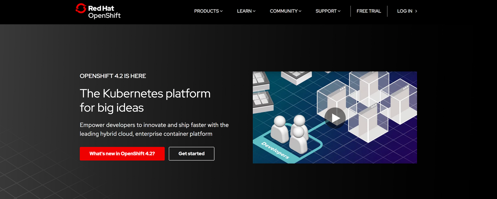
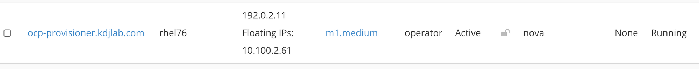
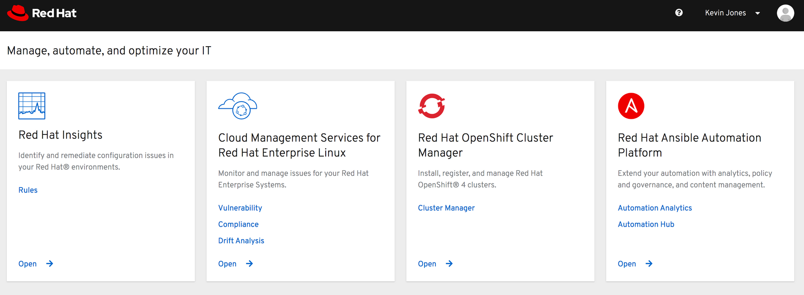
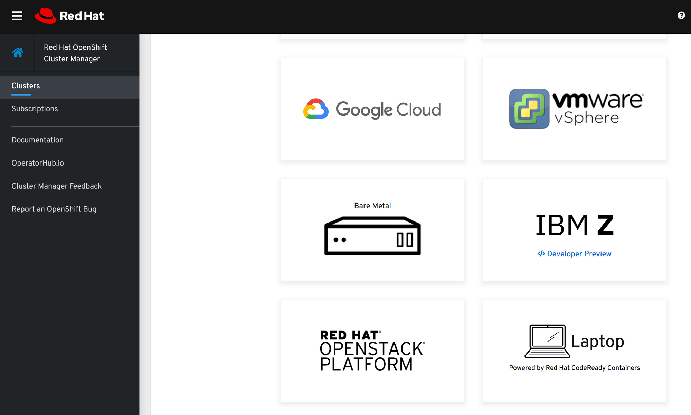
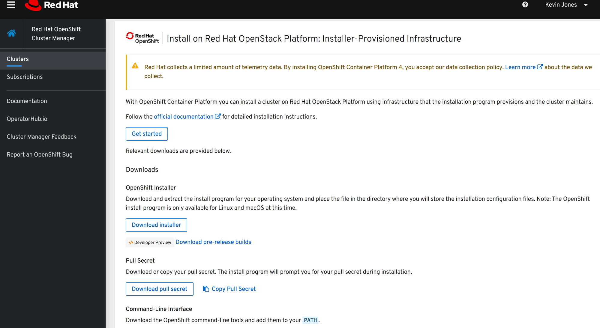
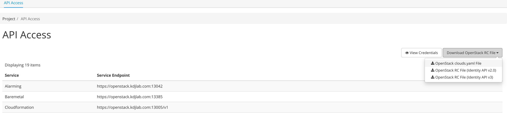
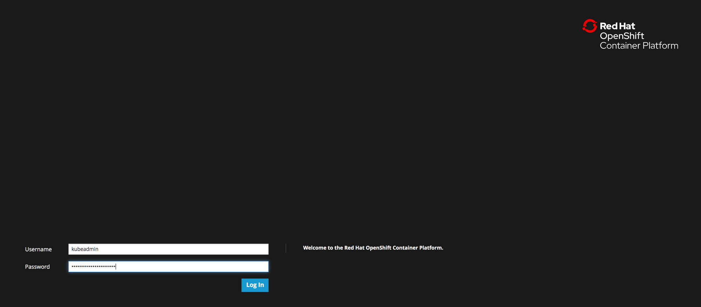

While preparing for a couple recent presentations, I wanted to experiment with the automated installation of OpenShift Container Platform (OCP) 4.2 on top of an existing Red Hat OpenStack Platform (RHOSP) 13 deployment.

RHOSP 13 is a special release for Red Hat because it is our current long term supported OpenStack release. Therefore most production RHOSP customers today are running or trying to upgrade to version 13.

## Prerequisites

1. Existing RHOSP 13 deployment
2. Access to cloud.redhat.com with an existing Red Hat Network account
3. Instances on your RHOSP 13 deployment should have full access to the internet to pull content and communicate with cloud.redhat.com
4. Upload a [Red Hat CoreOS image](https://docs.openshift.com/container-platform/4.2/installing/installing_openstack/installing-openstack-installer-custom.html#installation-osp-creating-image_installing-openstack-installer-custom) into OpenStack image service

> NOTE: The rhcos qcow2 file is actually compressed

```
[stack@director guest_images]$ qemu-img info rhcos-4.2.0-x86_64-openstack.qcow2 
image: rhcos-4.2.0-x86_64-openstack.qcow2
file format: raw
virtual size: 667M (699870720 bytes)
disk size: 667M
[stack@director guest_images]$ gunzip rhcos-4.2.0-x86_64-openstack.qcow2
[stack@director guest_images]$ mv rhcos-4.2.0-x86_64-openstack rhcos-4.2.0-x86_64-openstack.qcow2
[stack@director guest_images]$ qemu-img info rhcos-4.2.0-x86_64-openstack.qcow2 
image: rhcos-4.2.0-x86_64-openstack.qcow2
file format: qcow2
virtual size: 16G (17179869184 bytes)
disk size: 1.8G
cluster_size: 65536
Format specific information:
    compat: 1.1
    lazy refcounts: false
    refcount bits: 16
    corrupt: false
(overcloud) [stack@director guest_images]$ openstack image create rhcos --container-format bare --disk-format qcow2 --public --file rhcos-4.2.0-x86_64-openstack.qcow2
```

* One floating IP in your project for the API load balancer port
* One floating IP in your project for the apps wildcard load balancer port

## Required RHOSP 13 Deployment Options

There are two options that must be enabled on your RHOSP 13 deployment for OpenShfit 4.2 automated installation to work correctly.

* Neutron must have default DNS forwarders enabled

```
NeutronDhcpAgentDnsmasqDnsServers: ['1.1.1.1']
```

* If used Ceph RadosGW to back your Swift API for object storage, then you must enable "account in url" in your Ceph configuration

```
CephConfigOverrides:
  ...
  rgw_swift_account_in_url: true
```

Once you have added these config parameters to your deployment templates, run a stack update on your overcloud to set the parameters on your RHOSP overcloud.

Note that your [swift endpoints need to be updated for the Account In URL feature](https://opendev.org/openstack/tripleo-heat-templates/commit/086238e9110555f8612cb39336e9b553b5353e18) to work properly.

## UPDATE:

Vincent Cojot forwarded the following script that runs through and updates the swift endpoints. Thanks for sending, Vincent!

```
# Update endpoints
for myif in admin internal public
do
        url=$(openstack endpoint list --service swift --interface ${myif} -f value  -c URL)
        if [[ $url == *v1 ]]; then
                id=$(openstack endpoint list --service swift --interface ${myif} -f value  -c ID)
                newurl="${url}/AUTH_%(project_id)s"
                echo "Updating endpoint $url to $newurl"
                openstack endpoint set --service swift --interface ${myif} --enable --url "$newurl" $id
        fi
done
```

Before:

```
(overcloud) [stack@director ~]$ openstack endpoint list | grep swift
| 471b1c30720f49189bd46832dda42468 | regionOne | swift        | object-store    | True    | admin     | http://10.100.7.209:8080/swift/v1                     |
| c970710d68bf4f2fae69e2f3d033f08c | regionOne | swift        | object-store    | True    | internal  | http://10.100.7.209:8080/swift/v1                     |
| d67de8d0a0c149e5a8d7d6a66eff52f9 | regionOne | swift        | object-store    | True    | public    | https://openstack.kdjlab.com:13808/swift/v1           |
```

Commands to delete existing:

```
(overcloud) [stack@director ~]$ openstack endpoint delete 471b1c30720f49189bd46832dda42468
(overcloud) [stack@director ~]$ openstack endpoint delete c970710d68bf4f2fae69e2f3d033f08c
(overcloud) [stack@director ~]$ openstack endpoint delete d67de8d0a0c149e5a8d7d6a66eff52f9
```

Commands to create new Swift endpoints:

```
# Get the service id for Swift
(overcloud) [stack@director ~]$ openstack service list | grep swift
| 08ef126f97ab48fb94caf854e2933d3b | swift      | object-store    |

(overcloud) [stack@director ~]$ openstack endpoint create --enable 08ef126f97ab48fb94caf854e2933d3b --region regionOne public 'https://openstack.kdjlab.com:13808/swift/v1/AUTH_%(project_id)s'
+--------------+-----------------------------------------------------------------+
| Field        | Value                                                           |
+--------------+-----------------------------------------------------------------+
| enabled      | True                                                            |
| id           | 989ebf9c21a5436bb0a5bdc9e19b24c3                                |
| interface    | public                                                          |
| region       | regionOne                                                       |
| region_id    | regionOne                                                       |
| service_id   | 08ef126f97ab48fb94caf854e2933d3b                                |
| service_name | swift                                                           |
| service_type | object-store                                                    |
| url          | https://openstack.kdjlab.com:13808/swift/v1/AUTH_%(project_id)s |
+--------------+-----------------------------------------------------------------+
(overcloud) [stack@director ~]$ openstack endpoint create --enable 08ef126f97ab48fb94caf854e2933d3b --region regionOne admin 'http://10.100.7.209:8080/swift/v1/AUTH_%(project_id)s'
+--------------+-------------------------------------------------------+
| Field        | Value                                                 |
+--------------+-------------------------------------------------------+
| enabled      | True                                                  |
| id           | fe15990604ba4c99a1ec239637005139                      |
| interface    | admin                                                 |
| region       | regionOne                                             |
| region_id    | regionOne                                             |
| service_id   | 08ef126f97ab48fb94caf854e2933d3b                      |
| service_name | swift                                                 |
| service_type | object-store                                          |
| url          | http://10.100.7.209:8080/swift/v1/AUTH_%(project_id)s |
+--------------+-------------------------------------------------------+
(overcloud) [stack@director ~]$ openstack endpoint create --enable 08ef126f97ab48fb94caf854e2933d3b --region regionOne internal 'http://10.100.7.209:8080/swift/v1/AUTH_%(project_id)s'
+--------------+-------------------------------------------------------+
| Field        | Value                                                 |
+--------------+-------------------------------------------------------+
| enabled      | True                                                  |
| id           | 21a5af48fa73480cbdc060bb6187d87f                      |
| interface    | internal                                              |
| region       | regionOne                                             |
| region_id    | regionOne                                             |
| service_id   | 08ef126f97ab48fb94caf854e2933d3b                      |
| service_name | swift                                                 |
| service_type | object-store                                          |
| url          | http://10.100.7.209:8080/swift/v1/AUTH_%(project_id)s |
+--------------+-------------------------------------------------------+
```

> NOTE: The endpoints in RHOSP 13 have to be fixed after every director operation.

Now we can set up our swift account for temporary URLs

```
(overcloud) [stack@director ~]$ openstack role create swiftoperator
(overcloud) [stack@director ~]$ openstack role add --user operator --project operators swiftoperator
(overcloud) [stack@director ~]$ openstack object store account set --property Temp-URL-Key=SuperSecretKey
(overcloud) [stack@director ~]$ openstack object store account show
+------------+---------------------------------------+
| Field      | Value                                 |
+------------+---------------------------------------+
| Account    | AUTH_9e336d72736742ae949d49e3dda018fb |
| Bytes      | 0                                     |
| Containers | 0                                     |
| Objects    | 0                                     |
| properties | Temp-Url-Key='SuperSecretKey'         |
+------------+---------------------------------------+
```

## Prepare Your OCP 4.2 Provisioner

You need to select a Linux or Mac system to run the OCP 4.2 installation from. You can actually do this with a Linux instance in your RHOSP 13 environment like I have below.



Go to [cloud.redhat.com](https://cloud.redhat.com) and login.


Click "Cluster Manager", then click "Create Cluster" and select OpenStack.







You can follow the official docs at:

[https://docs.openshift.com/container-platform/4.2/installing/installing_openstack/installing-openstack-installer-custom.html](https://docs.openshift.com/container-platform/4.2/installing/installing_openstack/installing-openstack-installer-custom.html)

Download the OpenShift installer.

```
[cloud-user@ocp-provisioner ~]$ wget https://mirror.openshift.com/pub/openshift-v4/clients/ocp/latest/openshift-install-linux-4.2.8.tar.gz
--2019-11-29 17:47:24--  https://mirror.openshift.com/pub/openshift-v4/clients/ocp/latest/openshift-install-linux-4.2.8.tar.gz
Resolving mirror.openshift.com (mirror.openshift.com)... 54.173.18.88, 54.172.173.155, 54.172.163.83
Connecting to mirror.openshift.com (mirror.openshift.com)|54.173.18.88|:443... connected.
HTTP request sent, awaiting response... 200 OK
Length: 71494884 (68M) [application/x-gzip]
Saving to: ‘openshift-install-linux-4.2.8.tar.gz’

100%[======================================================================================================================================>] 71,494,884  10.7MB/s   in 6.4s   

2019-11-29 17:47:30 (10.7 MB/s) - ‘openshift-install-linux-4.2.8.tar.gz’ saved [71494884/71494884]
```

Download the CLI tools to be utilized later.

```
[cloud-user@ocp-provisioner ~]$ wget https://mirror.openshift.com/pub/openshift-v4/clients/ocp/latest/openshift-client-linux-4.2.8.tar.gz
--2019-11-29 17:53:02--  https://mirror.openshift.com/pub/openshift-v4/clients/ocp/latest/openshift-client-linux-4.2.8.tar.gz
Resolving mirror.openshift.com (mirror.openshift.com)... 54.173.18.88, 54.172.163.83, 54.172.173.155
Connecting to mirror.openshift.com (mirror.openshift.com)|54.173.18.88|:443... connected.
HTTP request sent, awaiting response... 200 OK
Length: 24547243 (23M) [application/x-gzip]
Saving to: ‘openshift-client-linux-4.2.8.tar.gz’

100%[======================================================================================================================================>] 24,547,243   757KB/s   in 33s    

2019-11-29 17:53:35 (728 KB/s) - ‘openshift-client-linux-4.2.8.tar.gz’ saved [24547243/24547243]
```

Extract the OpenShift installer.

```
[cloud-user@ocp-provisioner ~]$ tar xvf openshift-install-linux-4.2.8.tar.gz 
README.md
openshift-install
[cloud-user@ocp-provisioner ~]$ ls
openshift-client-linux-4.2.8.tar.gz  openshift-install  openshift-install-linux-4.2.8.tar.gz  README.md
```

Download your clouds.yaml file for your OpenStack cloud authentication and copy to your OpenShift provisioner.



```
kevin:~$ scp Downloads/clouds.yaml cloud-user@10.100.2.61:
Warning: Permanently added '10.100.2.61' (ECDSA) to the list of known hosts.
clouds.yaml
```

> NOTE: You need to add your password to your clouds.yaml file as the Horizon download does not include it.

Now we can create an installation config for our new OCP 4.2 cluster.

```
[cloud-user@ocp-provisioner ~]$ ./openshift-install create install-config --dir=cluster1/
? Platform  [Use arrows to move, type to filter, ? for more help]
  aws
  azure
  gcp
> openstack
...
? Cloud  [Use arrows to move, type to filter, ? for more help]
> openstack
...
? ExternalNetwork  [Use arrows to move, type to filter, ? for more help]
  lb-mgmt-net
  overcloud-baremetal
  private
  provisioning
> public
...
? APIFloatingIPAddress  [Use arrows to move, type to filter, ? for more help]
  10.100.2.59
> 10.100.2.71
  10.100.2.72
  10.100.2.73
  10.100.2.74
  10.100.2.75
...
? FlavorName  [Use arrows to move, type to filter, ? for more help]
  m1.medium
  m1.ocp-master
  m1.ocp-node
  m1.ocp-node-min
  m1.ocp-small
  m1.rhel-min-migration
  m1.sat6-min
> ocp4.min
...
? Base Domain [? for help] kdjlab.com
? Cluster Name [? for help] ocp42
? Pull Secret [? for help] ***************************************************************************************************************
```

After you've pasted your pull secret from cloud.redhat.com, hit enter. After a few seconds you can see your install-config.yaml file in your cluster folder.

> NOTE: if you want to keep this install-config.yaml file, make a copy of it in a location outside of the cluster folder. $ cp cluster1/install-config.yaml ./

For the purposes of this install, we are going to reduce the amount of masters and workers that get deployed. The default is 3 for both. We will only deploy 1 of each. To do this we need to modify the install-config.yaml file that was generated.

```
compute:
  hyperthreading: Enabled
  name: worker
  platform: {}
  replicas: 1
controlPlane:
  hyperthreading: Enabled
  name: master
  platform: {}
  replicas: 1
```

Also, we need to create an API dns record to point to the floating IP we chose during the install-config command.

```
$ ping api.ocp42.kdjlab.com
PING api.ocp42.kdjlab.com (10.100.2.71) 56(84) bytes of data.
```

At this point we are ready to deploy the cluster.

```
[cloud-user@ocp-provisioner ~]$ ./openshift-install create cluster --dir=cluster1/ --log-level=debug
DEBUG OpenShift Installer v4.2.8                   
DEBUG Built from commit 425e4ff0037487e32571258640b39f56d5ee5572 
DEBUG Fetching "Terraform Variables"...            
DEBUG Loading "Terraform Variables"...             
DEBUG   Loading "Cluster ID"...                    
DEBUG     Loading "Install Config"...              
...
DEBUG module.masters.openstack_compute_instance_v2.master_conf[0]: Creation complete after 1m4s [id=64ebe48b-3706-4355-9d1e-b2930b16c4e6] 
DEBUG                                              
DEBUG Apply complete! Resources: 64 added, 0 changed, 0 destroyed. 
DEBUG OpenShift Installer v4.2.8                   
DEBUG Built from commit 425e4ff0037487e32571258640b39f56d5ee5572 
INFO Waiting up to 30m0s for the Kubernetes API at https://api.ocp42.kdjlab.com:6443... 
DEBUG Still waiting for the Kubernetes API: Get https://api.ocp42.kdjlab.com:6443/version?timeout=32s: dial tcp 10.100.2.71:6443: connect: no route to host
...
DEBUG Still waiting for the Kubernetes API: the server could not find the requested resource
...
DEBUG Still waiting for the Kubernetes API: Get https://api.ocp42.kdjlab.com:6443/version?timeout=32s: dial tcp 10.100.2.71:6443: connect: connection refused 
INFO API v1.14.6+dea7fb9 up                       
INFO Waiting up to 30m0s for bootstrapping to complete...
...
INFO Waiting up to 30m0s for bootstrapping to complete... 
DEBUG Bootstrap status: complete                   
INFO Destroying the bootstrap resources..
...
DEBUG Destroy complete! Resources: 6 destroyed.    
INFO Waiting up to 30m0s for the cluster at https://api.ocp42.kdjlab.com:6443 to initialize...
...
DEBUG Still waiting for the cluster to initialize: Working towards 4.2.8 
DEBUG Still waiting for the cluster to initialize: Working towards 4.2.8: downloading update 
DEBUG Still waiting for the cluster to initialize: Working towards 4.2.8 
DEBUG Still waiting for the cluster to initialize: Working towards 4.2.8: 1% complete 
DEBUG Still waiting for the cluster to initialize: Working towards 4.2.8: 12% complete 
DEBUG Still waiting for the cluster to initialize: Working towards 4.2.8: 18% complete 
DEBUG Still waiting for the cluster to initialize: Working towards 4.2.8: 20% complete 
DEBUG Still waiting for the cluster to initialize: Working towards 4.2.8: 50% complete
...
DEBUG Still waiting for the cluster to initialize: Working towards 4.2.8: 67% complete 
DEBUG Still waiting for the cluster to initialize: Working towards 4.2.8: 73% complete 
DEBUG Still waiting for the cluster to initialize: Working towards 4.2.8: 95% complete 
DEBUG Still waiting for the cluster to initialize: Working towards 4.2.8: 97% complete 
DEBUG Still waiting for the cluster to initialize: Working towards 4.2.8: 97% complete, waiting on authentication, console, image-registry, monitoring, openshift-samples 
DEBUG Still waiting for the cluster to initialize: Working towards 4.2.8: 99% complete 
DEBUG Still waiting for the cluster to initialize: Working towards 4.2.8: 100% complete, waiting on authentication 
DEBUG Still waiting for the cluster to initialize: Working towards 4.2.8: 100% complete, waiting on authentication 
DEBUG Cluster is initialized                       
INFO Waiting up to 10m0s for the openshift-console route to be created... 
DEBUG Route found in openshift-console namespace: console 
DEBUG Route found in openshift-console namespace: downloads 
DEBUG OpenShift console route is created           
INFO Install complete!                            
INFO To access the cluster as the system:admin user when using 'oc', run 'export KUBECONFIG=/home/cloud-user/ocp42/cluster1/auth/kubeconfig' 
INFO Access the OpenShift web-console here: https://console-openshift-console.apps.ocp42.kdjlab.com 
INFO Login to the console with user: kubeadmin, password:  
```

> NOTE: I added --log-level parameter to show the deployment with debug level output. This helps early on as you are learning how the deployment works.

The console is actually ready, but there is one last step on OpenStack to make the app routes available. We need to add a floating IP to the ingress port that was created and add a dns wildcard record that points to that floating IP.

```
(overcloud) [stack@director ~]$ openstack port list | grep ingress
| 644891b6-de78-4e16-8a8b-1c7d1069536b | ocp42-6sqgz-ingress-port                                             | fa:16:3e:12:47:20 | ip_address='10.0.0.7', subnet_id='2a9e3519-efc9-4134-a736-9914b006d2f2'       | DOWN   |

(overcloud) [stack@director ~]$ openstack floating ip set --port ocp42-6sqgz-ingress-port 10.100.2.53

$ ping console-openshift-console.apps.ocp42.kdjlab.com
PING console-openshift-console.apps.ocp42.kdjlab.com (10.100.2.53): 56 data bytes
64 bytes from 10.100.2.53: icmp_seq=0 ttl=62 time=2.879 ms
64 bytes from 10.100.2.53: icmp_seq=1 ttl=62 time=1.850 ms
```



OCP 4.2 Running on Red Hat OpenStack Platform 13
