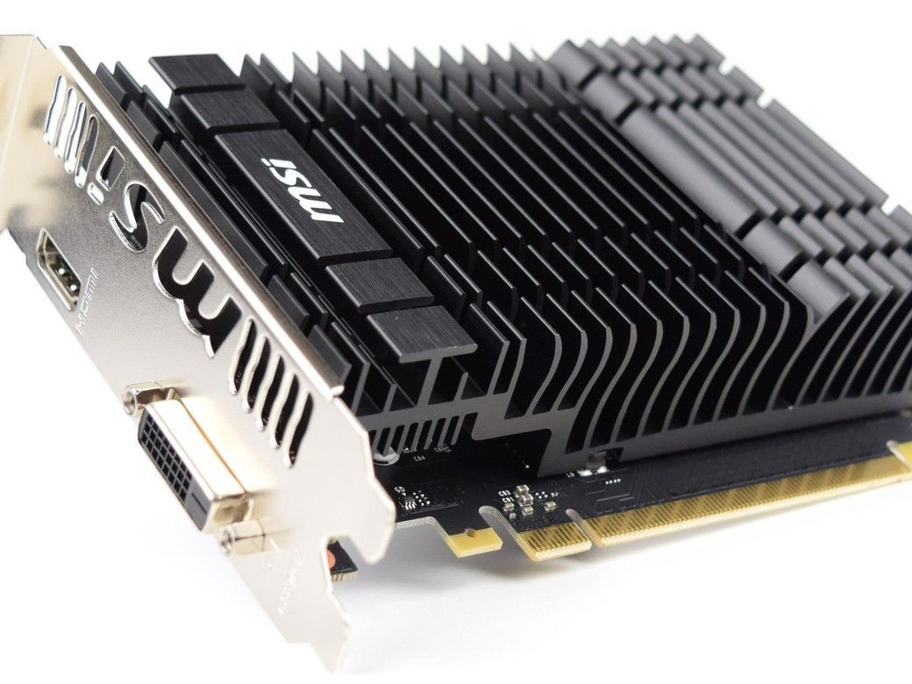

Recently, I've been looking for an inexpensive way to test out GPU utilization for compute in my home lab. I want to be able to test this on bare metal, in VMs and in Kubernetes. The GPU operator from NVIDIA requires GPUs with the Pascal microarchitecture or newer. This definitely slims down the available options for home labs particularly if looking to be cost conscious.

For this first attempt, I chose to go with an MSI variation of the [NVIDIA GeForce GT 1030](https://www.msi.com/Graphics-Card/GeForce-GT-1030-2GH-LP-OC.html). I had several constraints.

* A very small space to fit the GPU on the servers
* needed low power
* passive cooling
* reasonable price for a few toys in the lab (can be had for $79-99)

The idea isn't to get a super performant compute GPU, but just to have one that will work with most of the modern software. I ended up purchasing two so that I could have at least 2 VMs using PCI passthrough.

You could also go the vGPU route as well, but then the options for GPUs reduces even further and cost goes up. There are some really awesome options, but in my case, the cost/benefit, didn't make sense.

For lab infrastructure, I'm using OpenStack. OpenStack allows a tremendous amount of flexibility and gives me the ability to pass through the GPUs. Many virt platforms allow this, so if you are using ESXi, oVirt, ProxMox or others, there will be a way to pass through the GPU. An advantage for using OpenStack is the API layer, it's integration with Ceph for storage, and great integration with OpenShift.

If you want to learn more about my OpenStack deployment, you can read through the [3 Part Series](/posts/openstack/deploying-rdo-in-a-cohesive-manner) I did recently.

The only things I've changed since I wrote that is switching to the Victoria release. I mainly did this for a new feature to create [vTPM devices for instances](/posts/openstack/enabling-virtual-tpm-in-openstack-victoria/). vTPM is unrelated to PCI Passthrough for this article, but useful for other work I'm testing.

## Obtain Vendor and Product IDs for the GPU

First we need to get some details about the GPU. For this you need to have an operating system on the server hosting the GPU.

SSH into the server to get the info needed.

```
(undercloud) [stack@tripleo-victoria ~]$ ssh heat-admin@10.100.4.83
[heat-admin@overcloud-compute-0 ~]$ sudo -i
[root@overcloud-compute-0 ~]# lspci -nn | grep -i nvidia
01:00.0 VGA compatible controller [0300]: NVIDIA Corporation GP108 [GeForce GT 1030] [10de:1d01] (rev a1)
01:00.1 Audio device [0403]: NVIDIA Corporation GP108 High Definition Audio Controller [10de:0fb8] (rev a1)
```

You'll notice that the 1030 has two devices, the GPU and a high def audio controller. This is important as you actually need to enable both devices for passthrough. Otherwise the host grabs the audio controller and the GPU won't get assigned to the VM with an error saying it is already in use.

The info we need is vendor id and product id.

* GPU: [10de:1d01]
* HD Audio: [10de:0fb8]

10de identifies NVIDIA and 1d01 identifies the 1030 GPU.

## Modify Templates for OpenStack TripleO Deployment

In my templates, I have a generic environment file named node-info.yaml where I place most of my parameters that aren't in already defined templates from tripleo-heat-templates. In /home/stack/templates/node-info.yaml I added the following.

```
  ComputeParameters:
    NovaReservedHostMemory: 1024
    NovaCPUAllocationRatio: 16.0
    KernelArgs: "intel_iommu=on iommu=pt vfio-pci.ids=10de:1d01,10de:0fb8"

  NovaSchedulerDefaultFilters: ['AvailabilityZoneFilter','ComputeFilter','ComputeCapabilitiesFilter','ImagePropertiesFilter','ServerGroupAntiAffinityFilter','ServerGroupAffinityFilter','PciPassthroughFilter','NUMATopologyFilter', 'AggregateInstanceExtraSpecsFilter']

  NovaPCIPassthrough:
    - vendor_id: "10de"
      product_id: "1d01"  
    - vendor_id: "10de"
      product_id: "0fb8"
  ControllerExtraConfig:
    nova::compute::reserved_host_memory: 4096
    nova::cpu_allocation_ratio: 4.0
    nova::pci::aliases:
      -  name: g1030
         product_id: '1d01'
         vendor_id: '10de'
      -  name: g1030audio
         product_id: '0fb8'
         vendor_id: '10de'
```

There is quite a bit going on here, but I will break down what is important.

* **ComputeParameters:** 
Notice the KernelArgs. This will enable [Intel IOMMU](https://en.wikipedia.org/wiki/Input%E2%80%93output_memory_management_unit) and set our 1030 GPU and Audio device to use the vfio_pci kernel driver. During the deployment, your compute nodes will reboot to apply these.
* **NovaSchedulerDefaultFilters:** 
These are the different [Nova scheduler filters](https://docs.openstack.org/nova/latest/user/filter-scheduler.html) that will be enabled. If you are looking at older articles, they might include RamFilter and RetryFilter. Both of these are no longer valid for Victoria release.
The key additional filters over the defaults are: 'PciPassthroughFilter','NUMATopologyFilter', 'AggregateInstanceExtraSpecsFilter'
* **NovaPCIPassthrough:** 
This parameter identifies the specific PCI devices that we want to enable for passthrough. This is the vendor id and product id info we gathered from the host using lspci.
* **ControllerExtraConfig:** 
Lastly we need to create some aliases on our controllers. These allow us to add a metadata parameter to either flavors or images which specify an alias and will tell Nova that a specific type of device (and number of device) needs to be assigned to any instance created with that flavor or image. The name is arbitrary, so make it something that makes sense to you. You only need 1 alias per device type.

Now rerun your deployment with these parameters added.

```
(undercloud) [stack@tripleo-victoria ~]$ ./deploy.sh
...
Overcloud configuration completed for stack: overcloud
Overcloud Endpoint: http://192.168.100.40:5000
Overcloud Horizon Dashboard URL: http://192.168.100.40:80/dashboard
Overcloud rc file: /home/stack/overcloudrc
Overcloud Deployed without error

real    83m40.340s
user    72m4.876s
sys     16m39.907s
```

It should be noted that TripleO already blacklists the nouveau driver. You can confirm on your hosts by running the following command:

```
[root@overcloud-compute-0 ~]#  lsmod | grep nouveau
[root@overcloud-compute-0 ~]#
```

You should see nothing returned. If you do, then nouveau got loaded and your device will not be available for passthrough.

## Create GPU Flavor and Launch Instance

For this to work, since OpenStack Pike, there is an Image metadata property, [img_hide_hypervisor_id](https://docs.openstack.org/glance/latest/admin/useful-image-properties.html), that you need to set to yes on your images.

We can either add the pci alias metadata property to an existing flavor, or create a new one.

```
(overcloud) [stack@tripleo-victoria ~]$ openstack flavor create --vcpus 2 --ram 4096 --disk 20 --property "pci_passthrough:alias"="g1030:1" g1.medium
```

Now I can launch and instance with a GPU.

```
(overcloud) [stack@tripleo-victoria ~]$ openstack server create --flavor g1.medium --image centos8 --network private --key-name kdj --security-group default gpu-test.kdjlab.com
```

Once the instance is active and booted, assign a floating IP and SSH in to verify that the GPU is available as a PCI device.

```
[centos@gpu-test ~]$ sudo lspci -nnv | grep -i nvidia
00:05.0 VGA compatible controller [0300]: NVIDIA Corporation GP108 [GeForce GT 1030] [10de:1d01] (rev a1) (prog-if 00 [VGA controller])

[centos@gpu-test ~]$ nvidia-smi 
Sun Nov  1 10:06:40 2020       
+-----------------------------------------------------------------------------+
| NVIDIA-SMI 450.80.02    Driver Version: 450.80.02    CUDA Version: 11.0     |
|-------------------------------+----------------------+----------------------+
| GPU  Name        Persistence-M| Bus-Id        Disp.A | Volatile Uncorr. ECC |
| Fan  Temp  Perf  Pwr:Usage/Cap|         Memory-Usage | GPU-Util  Compute M. |
|                               |                      |               MIG M. |
|===============================+======================+======================|
|   0  GeForce GT 1030     Off  | 00000000:00:05.0 Off |                  N/A |
| 35%   44C    P0    N/A /  30W |      0MiB /  2001MiB |      0%      Default |
|                               |                      |                  N/A |
+-------------------------------+----------------------+----------------------+
                                                                               
+-----------------------------------------------------------------------------+
| Processes:                                                                  |
|  GPU   GI   CI        PID   Type   Process name                  GPU Memory |
|        ID   ID                                                   Usage      |
|=============================================================================|
|  No running processes found                                                 |
+-----------------------------------------------------------------------------+
```
